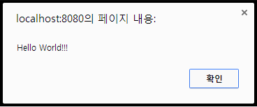
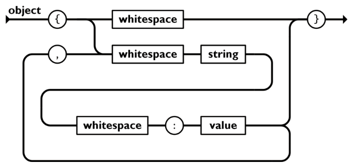
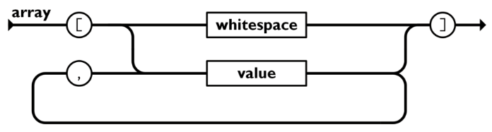
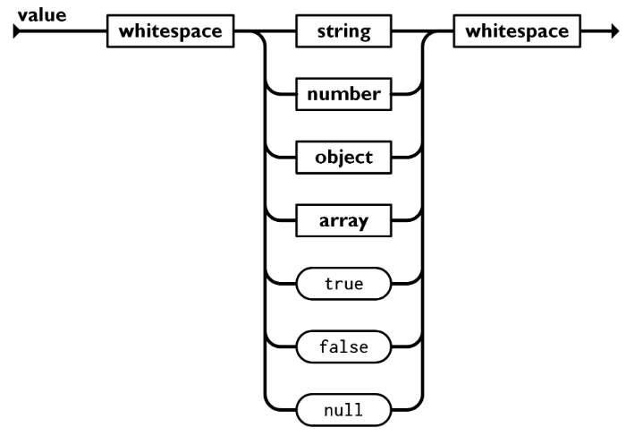

# 자바스크립트 기초 문법

## 목표
자바스크립트 기초 문법 학습

## 목차
- 자바스크립트 개요
- 개발 환경 구축
- 연산자
- 조건문, 반복문
- 객체, 배열, 함수
- ECMA Script6

---

## 1. 자바스크립트란?
- 참고: https://ko.javascript.info/intro

### 1.1 자바스크립트
- HTML 문서내에 코드를 직접 작성하고 마크업과의 상호 작용을 통해 웹 페이지의 동작을 향상시키기 위해 만들어진 프로그래밍 언어
- 웹 디자이너와 파트타임 개발자를 위해 쉽게 사용할 수 있는 언어로 고안됨
- Netscape Navigator 2.0에 탑재

### 1.2 JavaScript? LiveScript? Jscript? ECMAScript? Java?
- Mocha(코드명) -> LiveScript(Navigator 2.0 베타) -> JavaScript(Navigator 2.0 베타3)로 이름 변경
- Netscape Navigator에 Java 탑재를 논하던 시점에, 홍보효과를 위해서 [Java]라는 이름을 차용했을 뿐 Java 언어와는 전혀 무관
  + 다만 C 언어와 비슷한 문법을 가지는 C 패밀리 언어(C, Java, JavaScript 등)이기 때문에 Java 언어와 비슷한 문법을 사용함
- Internet Explorer 3.0에 JavaScript와 비슷한 기능이 Jscript란 이름으로 탑재
- ECMA에서 ECMAScript라는 이름으로 표준화
  + ECMA(European Computer Manufacturers Association): 전자 통신 및 컴퓨터 시스템의 표준을 개발하는 국제적인 비영리 기관으로 유럽 컴퓨터 제조업체 협회에서 시작되었지만 현재는 전 세계적인 조직으로 발전함

---

## 2. 자바스크립트 역사

- 1996년 03월: Netscape Navigator 2.0에 JavaScript 탑재
- 1996년 08월: Internet Explorer 3.0에 JScript 탑재
- 1997년 06월: ECMAScript 1.0표준(ECMA-262)
- 1998년 08월: ECMAScript 2
- 1999년 12월: ECMAScript 3
- 2009년 12월: ECMAScript 5(4는 폐기됨)
- 2011년 06월: ECMAScript 5.1
- 2015년 06월: ECMAScript 6(ECMAScript 2015)
- 2016년 06월: ECMAScript 2016(매년 6월에 연도별 새 버전 발표)
- ...
- 2025년 06월: ECMAScript 2025

---

## 3. 자바스크립트로 할 수 있는 일
- 참고: https://ko.javascript.info/intro#ref-1649

### 3.1 유효성 검증
- 사용자의 폼 입력 데이터 유효성 검증
- 필수 입력사항 확인
- 데이터 형식(문자, 숫자, 이메일 등)

### 3.2 이벤트 처리
- 클릭, 마우스 이동, 키보드 입력 등 사용자가 브라우저 내에서 발생시키는 이벤트에 대한 처리

### 3.3 문서 제어(DOM)
- HTML 문서에 엘리먼트를 생성, 삽입, 이동, 삭제 등 변경 작업

### 3.4 서버와 통신
- Ajax

### 3.5 HTML5
- 데이터관리(Web Storage)
- 실시간 통신(Web Socket)
- 위치추적(Geolocation API)
- 멀티스레드(Web Workers)
- 디바이스 제어(카메라, 마이크, 진동 등)

### 3.6 서버사이드 프로그래밍
- Node.js

---

## 4. 개발 환경 구성
- 참고: https://ko.javascript.info/code-editors

### 4.1 웹 브라우저
- Chrome [다운로드](https://www.google.com/intl/ko_kr/chrome)

### 4.2 웹 서버
- Live Server

### 4.3 백엔드 서버
- Node.js [다운로드](https://nodejs.org/en/download)

### 4.4 IDE
- Visual Studio Code [다운로드](https://code.visualstudio.com/download)

### 4.5 Github Repository
- https://github.com/FEBC-15/js

---

## 5. 자바스크립트 코드의 위치
- 참고: https://ko.javascript.info/hello-world

### 5.1 HTML 문서내에 `<script>` 태그를 이용하여 코드를 직접 작성
- type 속성 생략시 "text/javascript"로 인식

**[ex01-01.html](../workspace-ins/ch01/ex01-01.html)**
```html
...
<head>
  <script type="text/javascript">
    alert('Hello World!!!');
  </script>
</head>
...
```



### 5.2 js 확장자를 가진 파일 작성 후 `<script>` 태그에 src 속성으로 지정
 
**[ex01-02.js](../workspace-ins/ch01/ex01-02.js)**
```js
alert('외부 스크립트 로딩');
```

- `<script>` 태그 내부에 작성할 코드가 없더라도 반드시 닫는 태그 필요 (`</script>`)
- src 속성이 지정되면 `<script></script>` 내부의 코드는 무시됨

**[ex01-02.html](../workspace-ins/ch01/ex01-02.html)**
```html
...
<head>
  <script src="ex01-02.js"></script>
</head>
...
```

---

## 6. 명령문과 주석
- 참고: https://ko.javascript.info/structure

### 6.1 명령문
- 자바스크립트는 명령문의 집합으로 구성되며 인터프리터가 명령문을 순차적으로 해석하여 실행
- 명령문은 줄바꿈이나 `;`(세미콜론)으로 구분

```js
명령문1;
명령문2
명령문3;
명령문4; 명령문5;
```

**[ex01-04.js](../workspace-ins/ch01/ex01-04.js)**
```js
console.log('Hello World!');
console.log('Hello ')
console.log('World!!');
console.log('Hello '); console.log('World!!!');
```

### 6.2 주석
- 주석은 코드의 실행에는 영향을 주지 않지만, 코드를 이해하기 쉽게 만들어주는 설명문
- 개발자가 코드의 목적이나 동작을 설명하거나, 임시로 코드를 비활성화할 때 사용

#### 한 줄 주석
- `//` 로 지정하며 `//` 뒤의 모든 문자가 주석 처리됨

```js
// 주석입니다.
// console.log('Hello World!');
console.log('Hello '); // console.log('World!!!');
```

#### 블럭 주석
- `/*` 로 시작하고 `*/`로 종료하며 시작과 종료 사이의 모든 문자가 주석 처리됨
- 여러줄에 걸쳐서 적용 가능

**[ex01-04.js](../workspace-ins/ch01/ex01-04.js)**
```js
/*
  console.log('Hello World!');
  console.log('Hello ');
*/

/* console.log('Hello '); */ console.log('World!!!');
```

---

## 7. 변수(variable)
- 참고: https://ko.javascript.info/variables

### 7.1 변수(variable)
- "var": 라틴어 "varius"에서 유래, "다르다", "변하다"라는 의미
- "able": "~할 수 있는", "~의 능력이 있는" 이라는 뜻을 가진 접미사

### 7.2 변수(變數)
- 변(變): 변화, 바뀌다
- 수(數): 숫자, 셈, 개수

### 7.3 변수란?
- 변할 수 있는 수(값, 데이터)
- 프로그램 내에서 값이 변경될 수 있는 저장소를 가리킴
- 변수에 값을 저장한 후 그 값이 필요할 때 변수를 통해서 값을 사용
- 언제든지 그 값을 수정할 수 있음

- 예시
  + 주소 = 서울시 강남구 ...
  + 나이 = 29
  + 연봉 = 3억

### 7.4 변수 선언과 초기화
- 변수 선언은 변수를 사용하기 전에 미리 선언하는 것을 말하며, 초기화는 변수를 선언할 때 동시에 값을 할당하는 것을 의미

#### var
- `var 변수명;`: 전통적인 변수 선언
- `var 변수명 = 초기값;`: 변수 선언과 동시에 초기화

#### let
- `let 변수명;`: 블록 스코프 변수 선언
- `let 변수명 = 초기값;`: 블록 스코프 변수 선언과 동시에 초기화

#### const
- `const 변수명 = 초기값;`: 상수(constant, 재할당 불가) 선언과 동시에 초기화 (초기값 필수)

**[ex01-05.js](../workspace-ins/ch01/ex01-05.js)**
```js
var a;
var b, c;
var d=10, e=100;
```

### 7.5 식별자 명명 규칙
- 변수명, 함수명, 클래스명 등의 이름(식별자)을 지을 때 사용하는 규칙
- 영문자, 숫자, `_`, `$`
- 첫 글자는 영문자, `_`, `$`만 가능
- 유니코드 문자 사용 가능
  + 특수문자와 제어문자를 제외한 전세계 문자도 사용 가능하지만 권장하지는 않음
- 대소문자 구별
- 예약어는 변수명으로 사용 못함
  + 예약어: 언어 설계상 변수명이나 함수명으로 쓸 수 없도록 막아둔 단어
    * 키워드: 예약어 중 실제 문법적으로 의미가 있는 단어(var, let, const, if, for, function 등)
    + 미래 예약어: 현재 사용하고 있지는 않지만 미래를 위해서 미리 만들어둔 키워드(enum, implements, interface 등)
- 관례적인 명명 규칙
  + 변수명, 함수명에는 주로 카멜 케이스(user, userName, userAge)
  + 클래스명에는 주로 파스칼 케이스(College, HighSchool)
  + 상수는 스네이크 케이스(COLOR_BLUE, COLOR_RED)

---

## 8. 리터럴(literal)

### 8.1 리터럴
- 프로그램 소스코드에 직접 입력된 고정된 값

### 숫자 리터럴
- 정수: `10`
- 실수: `3.14`
- 지수 표기법: `1e3`

### 문자열 리터럴
- 작은 따옴표: `'Hello'`
- 큰 따옴표: `"JavaScript"`
- 템플릿 리터럴: `` `Hello ${ js } World` ``

### 불린 리터럴
- 참: `true`
- 거짓: `false`

### 배열 리터럴
- `[ 1, 2, 3 ]`

### 객체 리터럴
- `{ name: '무지', age: 30 }`

### null 리터럴
- `null`

### undefined 리터럴
- `undefined`

---

## 9. 데이터 타입
- 참고: https://ko.javascript.info/types

### 9.1 강형(strongly typed) 언어
- 변수 선언시 데이터 타입을 지정하는 언어(C++, Java 등의 언어)

- Java의 예
```java
String name = "하츄핑";
name = 25; // 변수의 타입을 선언하지 않아서 에러 발생!!!
int age = 9;
```

### 9.2 약형(weakly typed) 언어
- 변수 선언시 데이터 타입을 지정하지 않는 언어(JavaScript, Python 등의 언어)
- 값에 따라서 자동으로 데이터 타입이 결정됨(동적 타입, dynamically typed)

- Javascript의 예
```js
var name = '하츄핑';
name = 25; // 변수의 타입을 선언하지 않아도 에러가 발생하지 않음. 다른 타입으로 재할당 가능
var age = 9;
```

### 9.3 원시 타입(Primitive type)
#### primitive
- primitive: "원초적인, 기초적인, 가장 기본적인" 이라는 뜻
- 프로그래밍에서 더 이상 쪼갤 수 없는 가장 기본 단위의 데이터 타입을 의미

#### 특징
- 변수에 값을 직접 저장

#### 종류
- number
- string
- boolean
- null
- undefined
- bigint
- symbol

### 9.4 참조 타입(Reference type)
#### 특징
- 변수에 값을 직접 저장하지 않고 값을 참조하는 주소를 저장

#### 종류
- object
  + Array
  + Function
  + Date
  + RegExp
  + ……

---

## 10. 원시 타입(Primitive type)
- 참고: https://ko.javascript.info/types

### 10.1 number: 숫자
- 64비트 부동소수점 방식
- 정수, 실수, 음수, 양수 구별 없음

```js
var temp = 15;
var temp = 15.3;
```

### 10.2 string: 문자
- 큰 따옴표나 작은 따옴표 안에 기술

```js
var name = "하츄핑";
var name = '하츄핑';
var msg = "하츄핑이 '안녕' 이라고 말했다.";
var msg = '하츄핑이 "안녕" 이라고 말했다.';
var msg = "하츄핑이 "안녕" 이라고 말했다."; // 에러 (따옴표 중첩)
var msg = "하츄핑이 \"안녕\" 이라고 말했다.";
```

### 10.3 boolean: 논리값
- 참(true) 또는 거짓(false) 둘 중 하나의 값을 가지는 데이터

```js
var isSeller = true;
var isSeller = false;
```

### 10.4 undefined: 값이 정의되지 않음
- 선언만 되고 값이 할당되지 않은 변수에는 타입과 값 모두 undefined로 지정됨

```js
var undefinedVar;
```

### 10.5 null: 값이 없음을 명시적으로 지정
- 개발자가 명시적으로 값이 비어있음을 지정
- 타입은 object가 됨

```js
var nullVar = null;
```

### 10.6 bigint: 큰 정수
- number의 범위: 약 ±1.8e+308
- number의 안전한 정수 범위: -2^53+1 ~ 2^53-1(약 9000조)
- number의 안전한 정수 범위보다 더 큰 정수도 표현 가능
- 값 뒤에 n을 붙이거나 BigInt() 함수의 인자로 값 지정

```js
var big = BigInt(Number.MAX_SAFE_INTEGER) + 100n;
```

### 10.7 symbol: 유일한 값
- 불변하고 고유함이 보장되는 값
- 주로 객체의 속성을 정의할때 다른 속성키와 충돌하지 않도록 지정

```js
var s1 = Symbol('hello');
var s2 = Symbol('hello');
console.log(s1 === s2); // false
```

---

## 11. 연산자
- 참고: https://ko.javascript.info/operators

### 11.1 산술 연산자
- `+`, `-`, `*`, `/`, `%`, `**`

```js
var age = 1 + 4; // 5
var age = 1 + 4 * 5; // 21
var age = (1 + 4) * 5; // 25
var age = 9 / 4 ; // 2.25
var age = 9 % 4; // 1 (%, 나머지 연산자)
var age = 2 ** 3; // 8 (** 거듭제곱 연산자)
var age = '나이는 ' + age + ' 입니다.'; // 나이는 1 입니다. (+, 결합 연산자)
```

### 11.2 대입 연산자
- 참고: https://ko.javascript.info/operators#ref-2477

- `=`, `+=`, `-=`, `*=`, `/=`, `%=`, `**=`
- 기본 대입 연산자(`=`): 우측 항목을 계산한 후 좌측 항목에 할당
- 덧셈 후 대입(`+=`): 좌측 항목에 우측 항목을 더한 후 좌측 항목에 할당(누적)

```js
var age = 20;
var year = 3 + 2; // year = 5
age = age + year; // age = 20 + 5 = 25
age += year; // age = age + year = 25 + 5 = 30
```

- 뺄셈 후 대입(`-=`)
- 곱셈 후 대입(`*=`)
- 나눗셈 후 대입(`/=`)
- 나머지 연산 후 대입(`%=`)
- 거듭제곱 후 대입(`**=`)

### 11.3 증감 연산자
- 참고: https://ko.javascript.info/operators#ref-2481

- `++`, `--`
- 값을 1 증가 또는 감소

```js
var count = 0;
count++; // count = count + 1; // 1
count++; // count = count + 1; // 2
count--; // count = count - 1; // 1
```

- 후위형(count++, count--)
  + 현재 값을 먼저 사용한 후 값을 증가 또는 감소
  + 다른 연산자와 함께 사용할 경우 원래 값이 연산에 반영된 후 값이 변경

- 전위형(++count, --count)
  + 값을 먼저 증가 또는 감소한 후 변경된 값을 사용
  + 다른 연산자와 함께 사용할 경우 증가/감소 값이 바로 반영

### 11.4 비교 연산자
- 참고: https://ko.javascript.info/comparison

- 두 항을 비교하여 참이면 true, 거짓이면 false를 반환
- `>`, `<`, `>=`, `<=`, `==`(동등), `===`(일치), `!=`, `!==`

```js
var result = 1 > 2; // false
var result = 10 <= 10; // true
var result = 100 == '100'; // true
var result = 100 === '100'; // false
var result = 100 != 100; // false
```

### 11.5 일치 연산자(`===`, identical)
- 참고: https://ko.javascript.info/comparison#ref-1417

- 두 데이터의 타입과 값을 모두 비교해서 값이 같아도 타입이 다르면 false

#### 일치 연산자 비교 규칙
- 타입이 다르면 false를 반환하고 타입이 같을 경우는 다음 규칙을 따름
  + 숫자이고 같은 값이면 true, 단 피연산자에 NaN 값이 하나라도 있으면 false
    ```js
    10 === 10 // true
    0 === 0 // true
    0 === -0 // true
    NaN === NaN // false
    ```
  + 문자열일 경우 같은 위치에 같은 문자가 있고 대소문자까지 일치하면 true
    ```js
    'hello' === 'hello' // true
    'hello' === 'Hello' // false
    ```
  + boolean일 경우 모두 true이거나 모두 false이면 true
    ```js
    true === true // true
    false === false // true
    ```
  + 모두 null이거나 모두 undefined일 경우 true, null과 undefined는 false
    ```js
    null === null // true
    undefined === undefined // true
    null === undefined // false
    ```
  + 같은 객체를 참조할 경우 true, 속성이 모두 같은 객체라도 참조 주소가 다른 경우 false
    ```js
    [10, 20] === [10, 20] // false
    ```

- `Object.is(a, b)`: 아래의 두 경우를 제외하면 `a === b` 와 동일한 기능
  ```js
  0 === -0 // true
  Object.is(0, -0) // false

  NaN === NaN // false
  Object.is(NaN, NaN) // true
  ```

### 11.6 동등 연산자
- 동등 연산자(`==`, equal)
  + 두 데이터의 타입이 다르면 적절히 형변환한 후 일치 연산(`===`)
  + 타입이 달라도 값이 같으면 true

#### 동등 연산자 비교 규칙
- 타입이 같은 경우 두 값이 일치하다면(`===`) true
- 두 값의 타입이 다를 경우
  + null과 undefined는 true
    ```js
    null == undefined // true
    ```
  + 한 값이 숫자이고 다른 하나가 문자열이면, 문자열을 숫자로 변환한 후 비교
    ```js
    10 == '10' => 10 === 10 // true
    ```
  + true는 1로 false는 0으로 변환한 후 비교
    ```js
    '1' == true => 1 == true => 1 === 1 // true
    ```
  + 객체와 숫자(또는 문자열) 비교시 객체의 valueOf() 먼저 찾고 없으면 toString() 메서드를 이용해서 기본값으로 변환한 후 비교. 단, Date는 toString()으로 바로 변환
    ```js
    1 == new Number(1) => 1 == (new Number(1)).valueOf() => 1 === 1 // true
    ```

### 11.7 논리 연산자
- 참고: https://ko.javascript.info/logical-operators

- `||` (OR, 논리합)
  + 일반적인 언어에서는 둘 중 하나라도 참이면 참을 반환하는 연산자이지만 자바스크립트에서는 다음의 규칙을 따름
    * 앞의 값이 참이면 앞의 값 반환
    * 앞의 값이 거짓이면 뒤의 값 반환
    ```js
    var invalidId = (id.length < 4) || (id.length > 12); // id 길이가 4보다 작거나 12보다 클 경우 true, 4 ~ 12일 경우 false
    ```

- `&&` (AND, 논리곱)
  + 일반적인 언어에서는 둘 다 참이면 참을 반환하는 연산자이지만 자바스크립트에서는 다음의 규칙을 따름
    * 앞의 값이 참이면 뒤의 값 반환
    * 앞의 값이 거짓이면 앞의 값 반환
    ```js
    var validId = (id != null) && (id.length >= 4); // id 값이 null이나 undefined가 아니고 4글자 이상일 경우 true
    ```

- `!` (NOT, 부정)
  + 참이면 거짓, 거짓이면 참 반환
  ```js
  !(10 < 100) => !(true) // false
  ```
  + `!!` 피연산자를 불린값으로 변환
  ```js
  !!0 => !!false => !true // false
  !!5 => !!true => !false // true
  !!'' => !!false => !true // false
  !!'hello' => !!true => !false // true
  !!null => !!false => !true // false
  !!{} => !!true => !false // true
  ```

#### 데이터 타입별로 truthy/falsy 값이 되는 기준
- falsy
  + boolean: false
  + number: 0, NaN
  + string: ''
  + null
  + undefined
- truthy: falsy 이외의 값

### 11.8 삼항 연산자 (조건부 연산자)
- 참고: https://ko.javascript.info/ifelse#ref-2451

- 조건에 따라 값을 선택하는 연산자
- `조건 ? 참일 때의 값 : 거짓일 때의 값;`

```js
var num = 10;
var result = num % 2 === 0 ? '짝수' : '홀수';
console.log(result); // '짝수'

var num = 15;
var result = num % 2 === 0 ? '짝수' : '홀수';
console.log(result); // '홀수'
```

### 11.9 연산자 우선순위
- 참고: https://ko.javascript.info/operators#ref-2476

- 연산자 우선순위란?
  + 여러 연산자가 같이 사용될 때 어떤 연산을 먼저 수행할지를 결정하는 규칙

#### 자바스크립트의 연산자 우선순위
- 아래로 갈수록 순위가 낮아짐
  + 괄호 `()`
  + 단항 연산자 `+`, `-`, `++`(전위형), `--`(전위형), `!`, `typeof`, `delete`
  + 산술 연산자 `*`, `/`, `%`, `+`, `-`
  + 비교 연산자 `>`, `<`, `>=`, `<=`, `==`, `===`, `!=`, `!==`
  + 논리 연산자 `&&` (AND), `||` (OR)
  + 조건부 (삼항) 연산자 `? :`
  + 대입 연산자 `=`, `+=`, `-=`, `*=`, `/=`, `%=`
  + 증감 연산자(후위형) `++`, `--`

---

## 12. 조건문
- 참고: https://ko.javascript.info/ifelse

### 12.1 if 문
- 지정한 조건식이 참(truthy)일 경우 해당 구문 수행

- 형식
```js
if (조건식) {
  수행구문1;
  수행구문2;
}
```
```js
var num = 9;
if (num < 10) {
  console.log(num + '는 10보다 작습니다.'); // 출력: 9는 10보다 작습니다.
}
```
```js
var num = 12;
if (num < 10) {
  console.log(num + '는 10보다 작습니다.'); // 출력 안됨
}
```

### 12.2 if ~ else
- 지정한 조건식이 참일 경우와 거짓일 경우 각각 해당 구문 수행

- 형식
```js
if (조건식) {
  수행구문1;
  수행구문2;
  ...
} else {
  수행구문3;
  수행구문4;
  ...
}
```
```js
var num = 9;
if (num % 2 === 0) {
  console.log(num + '는 짝수입니다.');
} else {
  console.log(num + '는 홀수입니다.'); // 출력: 9는 홀수입니다.
}
```

### 12.3 if ~ else if
- 지정한 조건식이 `true`일 경우 해당 구문을 수행하고 `false`일 경우 else if 문의 조건식을 순차적으로 비교하여 `true`에 해당하는 구문을 수행

- 형식
```js
if (조건식1) {
  수행구문1;
  수행구문2;
} else if (조건식2) {
  수행구문3;
  수행구문4;
} else if (조건식3) {
  수행구문5;
  수행구문6;
} else {
  수행구문7;
  수행구문8;
}
```
```js
var age = 19;
if (age >= 30) {
  console.log('30대 이상입니다.');
} else if (age >= 20) {
  console.log('20대 입니다.');
} else if (age >= 10) {
  console.log('10대 입니다.'); // 출력: 10대 입니다.
} else {
  console.log('10살 미만입니다.');
}
```

### 12.4 switch
- 참고: https://ko.javascript.info/switch

- switch에 지정한 비교값과 매칭되는(`===`) case 구문 수행
  + 일치하는 case가 없을 경우 default 구문 실행 (default를 생략하면 아무 코드도 실행 안됨)
  + break 구문을 만날 때까지 또는 마지막 case나 default 구문까지 실행
  + 비교값으로는 number, string 타입의 변수를 주로 사용

- 형식
```js
switch (비교값) {
  case 값1:
    수행구문1;
  case 값2:
    수행구문2;
    break;
  case 값3:
    수행구문3;
    수행구문4;
  default :
    수행구문5;
}
```

- 예시
  + 비교값 === 값1
    * 수행구문1;
    * 수행구문2;
  + 비교값 === 값2
    * 수행구문2;
  + 비교값 === 값3
    * 수행구문3;
    * 수행구문4;
    * 수행구문5;
  + 비교값과 매칭되는 case 없을 경우
    * 수행구문5;

---

## 13. 반복문
- 참고: https://ko.javascript.info/while-for

### 13.1 while 문
- 지정한 조건식이 참일 경우 조건이 거짓이 될 때까지 해당 블럭을 반복하여 수행

- 형식
```js
while (조건식) {
  반복할 구문1;
  반복할 구문2;
}
```
```js
var sum = 0;
var i = 1;
console.log('i\tsum');
while (i <= 10) { // i=1,2,3,4,5,6,7,8,9,10 => true, i=11 => false
  sum += i; // 0 + 1 + 2 + 3 + 4 + 5 + 6 + 7 + 8 + 9 + 10
  // 1  1
  // 2  3
  // 3  6
  // 4  10
  // 5  15
  // 6  21
  // 7  28
  // 8  36
  // 9  45
  // 10 55
  console.log(`${i}\t${sum}`);
  i++;
}
console.log('1 ~ 10 까지의 합계 sum:', sum); // 1 ~ 10 까지의 합계 sum: 55
```

### 13.2 do...while 문
- 코드 블럭을 먼저 실행한 후 지정한 조건식이 참일 경우 조건이 거짓이 될 때까지 해당 블럭을 반복하여 수행
- while 문은 최초의 조건식이 false일 경우 코드가 한번도 실행 안될 수 있지만 do...while 문은 코드가 최소 한번은 실행되어야 할때 사용

- 형식
```js
do {
  반복할 구문1;
  반복할 구문2;
} while (조건식);
```
```js
var sum = 0;
var i = 1;
console.log('i\tsum');
do {
  sum += i; // 0 + 1 + 2 + 3 + 4 + 5 + 6 + 7 + 8 + 9 + 10
  // 1  1
  // 2  3
  // 3  6
  // 4  10
  // 5  15
  // 6  21
  // 7  28
  // 8  36
  // 9  45
  // 10 55
  console.log(`${i}\t${sum}`);
  i++;
} while (i < 10); // i=1,2,3,4,5,6,7,8,9 => true, i=10 => false
console.log('1 ~ 10 까지의 합계 sum:', sum); // 1 ~ 10 까지의 합계 sum: 55
```

### 13.3 for 문
- 지정한 횟수만큼 반복적인 작업을 할 경우 사용
- 초기화: 조건식에 사용되는 변수를 초기화
- 조건식: 반복문을 실행할지 체크
- 증감식: 조건식에 사용되는 변수값을 증감

- 형식
```js
for (초기화; 조건식; 증감식) {
  반복할 구문1;
  반복할 구문2;
  ...
}
```
```js
var sum = 0;
console.log('i\tsum');
for (var i=1; i<=10; i++) { // i=1,2,3,4,5,6,7,8,9,10 => true, i=11 => false
  sum += i; // 0 + 1 + 2 + 3 + 4 + 5 + 6 + 7 + 8 + 9 + 10
  // 1  1
  // 2  3
  // 3  6
  // 4  10
  // 5  15
  // 6  21
  // 7  28
  // 8  36
  // 9  45
  // 10 55
  console.log(`${i}\t${sum}`);
}
console.log('1 ~ 10 까지의 합계 sum:', sum); // 1 ~ 10 까지의 합계 sum: 55
```

### 13.4 break
- 반복문이나 switch문을 즉시 종료
- break를 감싸고 있는 반복문이나 switch문의 코드 블럭(`{}`)을 빠져나오고 코드 블럭 이후의 코드로 실행이 넘어감
```js
var sum = 0;
console.log('i\tsum');
for (var i=1; true; i++) {
  sum += i;
  console.log(`${i}\t${sum}`);
  if (i === 10) {
    break;
  }
}
console.log('1 ~ 10 까지의 합계 sum:', sum); // 1 ~ 10 까지의 합계 sum: 55
```

### 13.5 continue
- 반복문 내에서 남아있는 코드를 건너뛰고 다음 반복으로 실행이 넘어감
```js
var sum = 0;
console.log('i\tsum');
for (var i=1; i<=10; i++) { // i=1,2,3,4,5,6,7,8,9,10 => true, i=11 => false
  if (i % 2 === 0) { // i=2,4,6,8,10 => true, i=1,3,5,7,9 => false
    continue; // for문 안의 나머지 코드를 실행하지 않고 증감식으로(i++) 바로 이동
  }
  sum += i;
  // 1  1
  // 3  4
  // 5  9
  // 7  16
  // 9  25
  console.log(`${i}\t${sum}`);
}
console.log('1 ~ 10 까지 홀수의 합계 sum:', sum); // 1 ~ 10 까지 홀수의 합계 sum: 25
```

---

## 14. 참조 타입(Object, 객체)
- 참고: https://ko.javascript.info/object

### 14.1 object
- key-value 쌍의 데이터 집합(속성, property)
- 속성의 값으로 모든 데이터 타입 지정 가능
  + 속성의 값으로 함수가 지정된 경우 메서드(method)라 부름
- 하나의 객체는 여러개의 속성과 메서드를 포함할 수 있음

```js
// 네개의 변수 정의
var kor = 100;
var eng = 80;
var math = 90;
var sum = kor + eng + math;

console.log('총점', sum); // 총점 270

eng += 10;
sum = kor + eng + math;
console.log('수정된 총점', sum); // 수정된 총점 280
```

```js
// 하나의 객체 정의
var score = new Object();
score.kor = 100;
score.eng = 80;
score.math = 90;
score.sum = score.kor + score.eng + score.math;

console.log('총점', score.sum); // 총점 270

score.eng += 10;
score.sum = score.kor + score.eng + score.math;
console.log('수정된 총점', score.sum); // 수정된 총점 280
```

### 14.2 객체 생성 1
- Object 생성자 함수로 빈 객체를 생성한 후에 속성과 메서드를 추가
- 객체의 속성과 메서드에 접근할 때는 dot 표기법( . )을 사용하거나 대괄호 표기법( ['속성명'] )을 사용

```js
var user = new Object();
user.name = 'kim';
user['age'] = 30;
user.job = 'student';
user['married'] = false;

console.log(user['name'], user.age, user.job, user['married']); // kim 30 student false
console.log(typeof user, user); // object { name: 'kim', age: 30, job: 'student', married: false }
```

### 14.3 객체 생성 2
- JSON(JavaScript Object Notation) 표기법 이용
- `{ 속성명1: 속성값1, 속성명2: 속성값2, ... }`

```js
var user = {
  name: 'lee',
  age: 35,
  job: 'teacher',
  married: true
};

console.log(user['name'], user.age, user.job, user['married']); // lee 35 teacher true
console.log(typeof user, user); // object { name: 'lee', age: 35, job: 'teacher', married: true }
```

### 14.4 JSON(JavaScript Object Notation)
- 참고 https://www.json.org/json-ko.html

- 자바스크립트의 객체와 배열을 표기하기 위한 리터럴
- 객체는 대부분의 언어가 object, record, struct, dictionary, hash table, map, 연상배열 등으로 구현
- 배열은 대부분의 언어가 array, vector, list, sequence 등으로 구현
- 소프트웨어의 설정값이나 네트워크 통신에서 교환하는 데이터의 포맷으로 널리 사용됨

#### 객체 표기법
- `{ 속성명1: 속성값1, 속성명2: 속성값2, ... }`



#### 배열 표기법
- `[ 요소값1, 요소값2, 요소값3, ... ]`



#### value에 지정할 수 있는 데이터 타입
- string, number, object, array, true, false, null



### 14.5 for...in 반복문
- 객체의 모든 속성에 접근할 때 사용

- 형식
```js
for (var 속성명을 저장할 변수 in 객체) { ... };
```
```js
var user = {
  name: 'lee',
  age: 35,
  job: 'teacher',
  married: true
};
for (var prop in user) { // user 객체의 속성 개수만큼 반복하면서 첫번째 속성명 부터 순차적으로 prop 변수에 저장
  // name: lee
  // age: 35
  // job: 'teacher'
  // married: true
  console.log(prop + ': ' + user[prop]);
}
```

### 14.6 delete 연산자
- 객체의 속성을 삭제할 때 사용

- 형식
```js
delete 객체.속성명;
```

- 예시
```js
var user = {
  name: 'lee',
  age: 35,
  job: 'teacher',
  married: true
};
delete user.job; // user의 job 속성 삭제
delete user.married; // user의 married 속성 삭제
for (var prop in user) {
  // name: lee
  // age: 35
  console.log(prop + ': ' + user[prop]);
}
```

---

## 15. 참조 타입(Array, 배열)
- 참고: https://ko.javascript.info/array

### 15.1 배열
- 하나의 변수에 여러개의 값을 지정하는 데이터 구조
- 순서정보(index)를 이용하여 각 요소를 참조(0부터 시작)

### 15.2 생성
- 크기를 미리 지정하지 않음
- Array 생성자 함수로 생성
  + `var score = new Array();`
- JSON 표기법 이용
  + `var score = [];`

### 15.3 초기화
- Array 생성자 함수로 생성 및 초기화
  + `var score = new Array(90, 70, 80);`
- JSON 표기법으로 생성 및 초기화
  + `var score = [ 90, 70, 80 ];`

```
┌────┬────┬────┐
│ 90 │ 70 │ 80 │
└────┴────┴────┘
 [0]  [1]  [2]
```

### 15.4 요소 추가
- index 이용

```js
score[3] = 86;
```

```
┌────┬────┬────┬────┐
│ 90 │ 70 │ 80 │ 86 |
└────┴────┴────┴────┘
 [0]  [1]  [2]  [3]
```

- 배열 메서드 이용
```js
score.push(59);
```

```
┌────┬────┬────┬────┬────┐
│ 90 │ 70 │ 80 │ 86 | 59 |
└────┴────┴────┴────┴────┘
 [0]  [1]  [2]  [3]  [4]
```

### 15.5 요소 읽기
- index 이용
```js
var score4 = score[3];
console.log(score4); // 86
```

- 배열 메서드 이용
```js
var score5 = score.pop();
console.log(score5); // 59
```

```
┌────┬────┬────┬────┐
│ 90 │ 70 │ 80 │ 86 |
└────┴────┴────┴────┘
 [0]  [1]  [2]  [3]
```

### 15.6 배열 요소의 수
- length 속성 이용

```js
var scoreLength = score.length;
console.log(scoreLength); // 4
```

### 15.7 배열의 모든 요소 접근
- for문 이용
```js
for (var i=0; i<arr.length; i++) {
  // 0 90
  // 1 70
  // 2 80
  // 3 86
  console.log(i, arr[i]);
}
```

- for...of문 이용
```js
for (var elem of arr) {
  // 90
  // 70
  // 80
  // 86
  console.log(elem);
}
```

### 15.8 유사 배열 객체 (Like-Array Object)
- 유사 배열 객체란?
  + 배열과 비슷하게 사용할 수 있는 객체
  + 사용법을 보면 배열 같지만 실제 배열이 아닌 일반 객체

#### 특징
- index를 통한 접근: 배열처럼 index를 사용해서 각 요소에 접근 가능
- length 속성: 배열처럼 length 속성이 있어서 for 구문을 이용하면 모든 요소 참조 가능
- 배열 메서드 없음: push, pop 등의 배열 메서드가 없음
- arguments, NodeList, String 등의 내장 객체가 유사 배열 객체로 만들어져 있음

#### 필요한 이유
- 주로 읽기를 목적으로 사용되는 객체일 경우(배열 요소를 수정/삭제하는 메서드가 필요 없음)
- 배열보다 더 적은 비용으로 생성 가능

#### 배열로 변환
- `Array.from(obj)`을 사용하면 배열로 변환 가능

### 15.9 2차원 배열, 다차원 배열
- 2차원 배열
  + 배열 안에 또 다른 배열들이 들어있는 배열
  + 행렬이나 테이블 형식의 데이터를 표현할 수 있음

```
    ┌────┬────┬────┬────┐
[0] │ 2  │ 4  │ 6  │ 8  │ 
    ├────┼────┼────┼────┤
[1] │ 3  │ 6  │ 9  │ 12 │ 
    ├────┼────┼────┼────┤
[2] │ 4  │ 8  │ 12 │ 36 │ 
    ├────┼────┼────┼────┤
[3] │ 5  │ 10 │ 15 │ 20 │ 
    └────┴────┴────┴────┘
     [0]  [1]  [2]  [3]
```

```js
var numbers = [
  [ 2, 4,  6,  8 ],
  [ 3, 6,  9,  12 ],
  [ 4, 8,  12, 36 ],
  [ 5, 10, 15, 20 ]
];

console.log(numbers[0]); // [ 2, 4, 6, 8 ]
console.log(numbers[1]); // [ 3, 6, 9, 12 ]
console.log(numbers[2]); // [ 4, 8, 12, 36 ]
console.log(numbers[3]); // [ 5, 10, 15, 20 ]

console.log(numbers[0][0]); // 2
console.log(numbers[0][1]); // 4
console.log(numbers[1][0]); // 3
console.log(numbers[3][2]); // 15
```

---

## 16. 참조 타입(Function, 함수)
- 참고: https://ko.javascript.info/function-basics

### 16.1 함수란?
- 함수(Function)는 특정 작업을 수행하는 코드 블록을 하나의 단위로 묶은 것
- 여러 명령어를 하나의 단위로 묶어서 재사용 가능하게 만듦
- 코드의 중복을 줄이고 가독성을 높이며 유지보수를 쉽게 함
- 함수명, 매개변수 목록, 실행구문, 반환값으로 구성됨

#### 함수 정의
```js
function 함수명(매개변수1, 매개변수2, ...) {
  실행할 구문1;
  실행할 구문2;
  ......
  return 반환값; // 선택사항
}
```

#### 함수 사용
- 함수를 정의한 후에는 함수명과 괄호를 사용하여 호출할 수 있음

```js
var result = 함수명(인자값1, 인자값2, ...);
```

### 16.2 함수의 특징과 장점
1. 재사용성: 한 번 정의하면 여러 번 호출 가능하여 코드 중복을 방지
2. 모듈화: 복잡한 프로그램을 작은 단위로 나누어 관리하기 쉬움
3. 캡슐화: 함수 내부의 구현 세부사항을 숨겨 코드의 안정성 향상
4. 가독성: 복잡한 로직을 의미있는 이름으로 표현하여 이해하기 쉬움
5. 유지보수: 함수 내부만 수정하면 모든 호출 부분에 자동 반영
6. 테스트: 개별 함수를 독립적으로 테스트하여 디버깅 용이

## 17. 참조 타입의 특징
### 17.1 원시 타입(Primitive Type)의 특징
- 원시 타입: number, string, boolean, null, undefined, bigint, symbol
- 변수에 값을 직접 저장
- 함수 호출 방식: 값에 의한 호출 (Call by Value)

### 17.2 참조 타입(Reference type)의 특징
- 참조 타입: object(Array, Function, Date, RegExp, ……)
- 변수에 값을 직접 저장하지 않고 값을 참조하는 주소를 저장
- 함수 호출 방식: 참조에 의한 호출 (Call by Reference)

## 18. 변수의 유효범위(scope)
### 18.1 전역 변수
- 함수 외부에서 선언한 변수
- html 페이지 내의 모든 스크립트에서 접근 가능
- 페이지가 로딩될 때 한번 생성하여 값이 유지됨
- window 객체의 속성으로 지정됨

### 18.2 지역 변수
- 함수 내부에서 선언한 변수
- 해당 함수 안에서만 접근 가능
- 함수가 호출될 때마다 새로 생성하여 값이 초기화
- 함수 내부에서 선언하지 않고 바로 사용하는 변수는 전역 변수로 동작

```js
var age = 20; // 전역 변수
year = 10; // 전역 변수
function getAge(year) { // 지역 변수
  var age = 30; // 지역 변수
  myAge = age + year; // 전역 변수
  alert(myAge);
  console.log(myAge);
}
```

```js
var age = 20; // 전역 변수
window.year = 10; // 전역 변수
function getAge(year) { // 지역 변수
  var age = 30; // 지역 변수
  window.myAge = age + year; // 전역 변수
  window.alert(myAge);
  window.console.log(myAge);
}
```

### 18.3 변수 우선순위
- 변수는 가까운 곳부터 찾음
  + 즉 지역변수 영역에서 먼저 찾고 없을 경우 전역변수에서 찾음

### 18.4 지역변수의 유효범위
- 대부분의 언어에서는 변수가 블록 단위의 유효범위를 갖지만 자바스크립트에서는 var로 선언한 변수가 함수 단위의 유효범위를 가짐

---

## 19 ES6 - 변수 선언문
- 참고: https://ko.javascript.info/var

### 19.1 var 선언문
- 전통적인 변수 선언 방법
- 형식
  + `var 변수명; // 변수 선언`
  + `var 변수명 = 초기값; // 변수 선언과 동시에 초기화`

#### 특징
- 함수 스코프를 가짐 (함수 내에서 선언되면 함수 전체에서 사용 가능)
- 호이스팅(hoisting) 발생 - 선언이 스코프의 최상단으로 끌어올려짐
- 중복 선언 가능
- 재할당 가능

### 19.2 let 선언문
- 블록 스코프 변수 선언
- 형식
  + `let 변수명; // 변수 선언`
  + `let 변수명 = 초기값; // 블록 스코프 변수 선언과 동시에 초기화`

#### 특징
- 블록 스코프를 가짐(중괄호 `{}` 내에서만 사용 가능)
- 중복 선언 불가능
- 재할당 가능

### 19.3 const 선언문
- 상수(변하지 않는 값)를 선언할 때 사용
- 형식
  + `const 변수명 = 초기값; // 상수 선언과 동시에 초기화 (초기값 필수)`

#### 특징
- 블록 스코프를 가짐(중괄호 `{}` 내에서만 사용 가능)
- 선언과 동시에 초기화 필수
- 중복 선언 불가능
- 재할당 불가능 (값 변경 불가)
- 객체나 배열 같은 참조형일 경우 내부 요소는 변경 가능

## 20 ES6 - Template literals
### 20.1 Template literals
- 백틱 기호(`` ` ` ``)를 이용해서 문자열 표현
- 여러줄의 문자열을 그대로 표현 가능
- 보간법 `${expression}` 사용 가능

```js
const info = `${user.userName}님의 정보입니다.
나이: ${user.age}
전화번호: ${user.phone}
주소: ${user.address}`;

// 출력
멋사핑님의 정보입니다.
나이: 8
전화번호: 0102223333
주소: 서울특별시 종로구 종로3길 17 D타워, 16-17층 (주)멋쟁이사자처럼
```

### 20.2 Tagged template
- 함수명 뒤에 사용할 경우 해당 함수가 호출되고 리터럴 내부의 문자열과 표현식이 분할되어 함수에 전달
- template literal 내의 문자열들은 표현식을 기준으로 분할되어 첫번째 인자로 전달됨(배열)
- 두번째 인자부터 표현식 값이 순서대로 전달됨

```js
function userInfo(strings, name, age, phone, address) {
  console.log(strings, name, age, phone, address);
  address = address.split(' ')[0];
  const first = phone.slice(0, phone.length-4);
  phone = first.padEnd(phone.length, 'X');
  const result = strings[0] + name + strings[1] + age + strings[2] + phone + strings[3] + address + strings[4];
  return result;
}
const kim = userInfo`${user.userName}님의 정보입니다. 나이: ${user.age} 전화번호: ${user.phone} 주소: ${user.address}`;

// 출력
[ '', '님의 정보입니다. 나이: ', ' 전화번호: ', ' 주소: ', '' ] 멋사핑 30 0102223333 서울특별시 종로구 종로3길 17 D타워, 16-17층 (주)멋쟁이사자처럼

멋사핑님의 정보입니다. 나이: 30 전화번호: 010222XXXX 주소: 서울특별시
```

## 21 ES6 - 구조 분해 할당(Destructuring assignment)
- 배열이나 객체의 속성을 해체하여 그 값을 개별 변수에 담을 수 있는 표현식

### 21.1 배열 구조 분해
```js
const foo = ['yellow', 'green', 'blue'];
const [one, two, three] = foo;
console.log(one, two, three); // yellow green blue
```

### 21.2 객체 구조 분해
```js
const kim = { userName: '구분핑', userAge: 35 };
const { userName, userAge: age } = kim;
console.log(userName, age); // 구분핑 35
```

## 22 ES6 - 기본값 매개변수(Default parameters)
- 함수 호출시 인자값을 전달하지 않으면 undefined가 전달됨
- 값이 전달되지 않거나 undefined를 인자값으로 전달한 경우 지정한 매개변수를 기본값으로 초기화

```js
function sum(a, b = 0) {
  return a + b;
}
console.log(sum(10, 20)); // 30
console.log(sum(30)); // 30
```

## 23 ES6 - 나머지 매개변수(Rest parameters)
- 정해지지 않은 수의 매개변수를 배열로 전달 받음
- 함수의 마지막 매개변수 앞에 `...` 을 붙임

```js
function fn(a, b, ...args) {
  console.log(a, b, args);
}

fn(); // undefined undefined []
fn(1); // 1 undefined []
fn(2, 3); // 2 3 []
fn(4, 5, 6); // 4 5 [6]
fn(7, 8, 9, 10, 11); // 7 8 [9, 10, 11]
```

## 24 ES6 - 전개 구문(Spread syntax)
- 배열이나 객체의 요소, 속성을 분해해서 배열, 객체, 함수에 전달
- 이터러블 객체(배열, 객체 등)를 손쉽게 복사
- 배열, 객체의 리터럴이나 함수의 인자값 변수 앞에 `...` 을 붙임
- 나머지 매개변수는 여러 매개변수를 하나의 배열로 압축 하는 반면 전개 연산자는 하나의 배열, 객체를 여러개의 요소, 속성으로 분해해서 전달

```js
const state = ['orange', 'yellow', 'green'];
const newState = [ ...state ]; // ['orange', 'yellow', 'green']

const state = {name: '전구핑', age: 30};
const newState = { ...state }; // {name: '전구핑', age: 30}

function sum(x, y) {
  return x + y;
}
const numbers = [1, 2];
console.log(sum(...numbers)); // 3
```