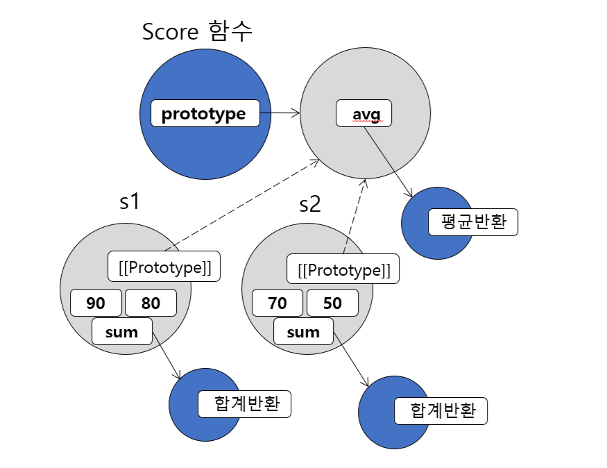
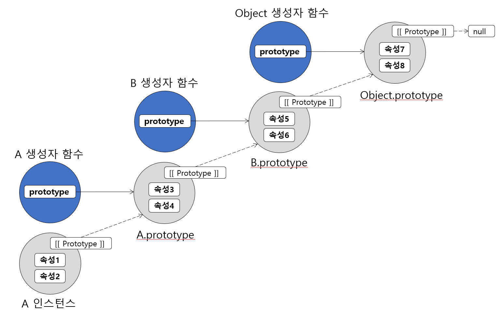
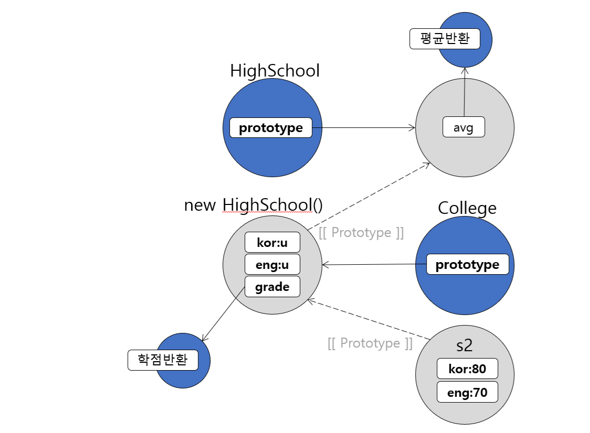

# 프로토타입, 상속과 클래스

## 학습 목표
- 프로토타입의 개념과 역할 이해
- 프로토타입 체인의 동작 원리 설명
- 생성자 함수와 프로토타입의 관계 이해
- typeof와 instanceof 연산자의 차이점 구분
- 프로토타입을 이용한 상속 구현
- 클래스 작성 방법과 상속 이해

## 목차
- [1. 프로토타입이란?](#1-프로토타입이란)
  + [1.1 생성자 내부에 메서드 정의 vs. prototype에 메서드 정의](#11-생성자-내부에-메서드-정의-vs-prototype에-메서드-정의)
- [2. 프로토타입과 생성자](#2-프로토타입과-생성자)
  + [2.1 객체 초기화 순서](#21-객체-초기화-순서)
- [3. 인스턴스 생성과 프로토타입](#3-인스턴스-생성과-프로토타입)
  + [3.1 prototype과 주변 객체의 참조관계](#31-prototype과-주변-객체의-참조관계)
- [4. 객체의 프로퍼티 참조](#4-객체의-프로퍼티-참조)
  + [4.1 객체의 프로퍼티 참조 순서(프로토타입 체인)](#41-객체의-프로퍼티-참조-순서프로토타입-체인)
- [5. Object](#5-object)
- [6. typeof 연산자](#6-typeof-연산자)
- [7. instanceof 연산자](#7-instanceof-연산자)
- [8. 상속](#8-상속)
  + [8.1 프로토타입 체인을 이용한 상속 기능 구현](#81-프로토타입-체인을-이용한-상속-기능-구현)
  + [8.2 중계 함수 추가](#82-중계-함수-추가)
  + [8.3 중계 함수의 유무에 따른 비교](#83-중계-함수의-유무에-따른-비교)
- [9. Class](#9-class)
  + [9.1 class 선언문](#91-class-선언문)
  + [9.2 class 표현식](#92-class-표현식)
  + [9.3 인스턴스의 속성 정의](#93-인스턴스의-속성-정의)
  + [9.4 인스턴스의 메서드 정의](#94-인스턴스의-메서드-정의)
  + [9.5 클래스 상속](#95-클래스-상속)
  + [9.6 Private class fields](#96-private-class-fields)

---

## 1. 프로토타입이란?

- 모든 함수가 기본으로 가지고 있는 속성으로 그 초기값은 빈 객체
- prototype에 추가한 속성은 해당 함수가 생성자로 사용될 때 생성된 인스턴스에서 내부 링크로 참조되어 사용됨
- prototype은 생성자 함수를 통해 생성되는 인스턴스의 메서드를 정의하는 역할

### 1.1 생성자 내부에 메서드 정의 vs. prototype에 메서드 정의

```js
function Score(kor, eng){
  this.kor = kor;
  this.eng = eng;
  this.sum = function(){
    return this.kor + this.eng;
  };
}
Score.prototype.avg = function(){
  return this.sum() / 2;
};
```

#### 💻 [03-01 prototype 속성 - Score](../workspace-ins/ch03/ex03-01.js)

---

## 2. 프로토타입과 생성자

### 2.1 객체 초기화 순서

1. 생성자 함수의 prototype 속성의 객체가 새로 만들어진 객체 인스턴스와 바인딩된다.
   - `__proto__` 속성(비공식)이나 `Object.getPrototypeOf(obj)` 메서드(공식)로 접근 가능
   - 크롬 개발자 도구의 콘솔에서 [[Prototype]] 링크로 확인 가능

2. 생성자 함수 내에서 this에 정의한 속성들이 객체 인스턴스에 추가된다.


---

## 3. 인스턴스 생성과 프로토타입

### 3.1 prototype과 주변 객체의 참조관계

<table><tr><td width="50%">

```js
function Score(kor, eng){
  this.kor = kor;
  this.eng = eng;
  this.sum = function(){
      return this.kor+this.eng;
  };
}

Score.prototype.avg = function(){
  return this.sum()/2;
};

const s1 = new Score(90, 80);
const s2 = new Score(70, 50);

s1.sum();
s1.avg();
s2.sum();
s2.avg();
```

</td><td></td></tr></table>

- sum 함수는 Score 객체를 생성할때마다 매번 생성되지만 avg 함수는 하나만 생성되고 모든 Score 객체에서 참조되어 사용되므로 메서드 정의시 prototype 속성에 정의해야 함수의 중복 생성을 막을 수 있음

https://github.com/user-attachments/assets/1c7b2502-68ff-427a-8fde-4fd6b0140260

---

## 4. 객체의 프로퍼티 참조

### 4.1 객체의 프로퍼티 참조 순서(프로토타입 체인)
1. 객체에 해당 프로퍼티가 있으면 사용한다.
2. 객체에 연결된 프로토타입에( [[Prototype]] ) 해당 프로퍼티가 있으면 사용한다.
3. 프로토타입에도 해당 프로퍼티가 없으면 프로퍼티를 찾을 때 까지 2번을 반복한다.
4. 연결된 프로토타입이 null이 될 때까지 찾아봐서 해당 프로퍼티가 없다면 그 값은 undefined가 된다.

- 즉, 프로퍼티 참조는 해당 객체에서 먼저 찾고, 실패했을 때 프로토타입을 타고 올라가면서 확인함



---

## 5. Object
- 프로토타입 체인의 마지막 객체
  + 모든 객체의 prototype 체인 마지막 객체는 Object이다.
  + 즉, Array, String, Number, RegExp, Date, Function 등의 내장 객체와 Score, Ping 등 사용자가 정의한 객체는 모두 프로토타입 체인에 의해서 자동으로 Object의 메서드를 사용할 수 있다.
- 내장된 생성자 함수의 prototype
  + Object, Array, Function, Date, XMLHttpRequest 등
  + 내장된 생성자 함수도 prototype 속성이 있으므로 이곳에 속성, 메서드를 추가해서 네이티브 객체의 기능을 확장할 수 있다.

#### 💻 [03-01 prototype 속성 - Score](../workspace-ins/ch03/ex03-01.js)

---

## 6. typeof 연산자
- 객체의 타입을 반환
- 기본 데이터 타입과 함수를 제외한 모든 객체에 대해 object 반환

```js
typeof 'hello'      -> "string"
typeof 10           -> "number"
typeof true         -> "boolean"
typeof function(){} -> "function"
typeof []           -> "object"
typeof {}           -> "object"
typeof new Score()  -> "object"
```

---

## 7. instanceof 연산자
- 객체가 지정한 생성자를 통해서 생성되었는지 판단
- 직접 생성된 생성자가 아니더라도 프로토타입 체인에 있는 생성자라면 true 반환
  + ```new Score() instanceof Object -> true```
- 객체 리터럴(`{}`)이나 배열 리터럴(`[]`)로 생성한 객체나 배열은 내부적으로 Object, Array 생성자 함수를 통해 생성이 된다.

```js
new Array() instanceof Array     -> true
[] instanceof Array              -> true
new Object() instanceof Object   -> true
({}) instanceof Object           -> true

new Score() instanceof Score     -> true
new Score() instanceof Object    -> true
```

#### 💻 [03-02 함수를 중복으로 정의 - User](../workspace-ins/ch03/ex03-02.js)
#### 💻 [03-02-02 prototype으로 함수의 중복을 제거 - User](../workspace-ins/ch03/ex03-02-02.js)

---

## 8. 상속

### 8.1 프로토타입 체인을 이용한 상속 기능 구현
- 자식 생성자의 프로토타입을 부모 생성자의 객체로 지정
- 부모 생성자의 모든 속성을 물려받아 사용할 수 있음

<table><tr><td width="50%">

```js
function HighSchool(kor, eng){
  this.kor = kor;
  this.eng = eng;
}

HighSchool.prototype.avg = function(){ ... };

function College(kor, eng){
  this.kor = kor;
  this.eng = eng;
}

College.prototype = new HighSchool();

College.prototype.grade = function(){ ... };

const s2 = new College(80, 70);

s2.avg();
s2.grade();
```

</td><td></td></tr></table>

https://github.com/user-attachments/assets/a14751c9-902c-47fd-97da-c6d8ce1d0217

#### 💻 [03-03 프로토타입 체인을 이용한 상속 - HighSchool, College](../workspace-ins/ch03/ex03-03.js)

---

### 8.2 중계 함수 추가
- 자식 생성자의 프로토타입을 부모 생성자의 객체로 지정하면 불필요한 부모 생성자 함수가 호출되므로 부모 프로토타입을 공유하는 중계 함수를 생성해서 구현

<table><tr><td width="50%">

```js
function HighSchool(kor, eng){
  this.kor = kor;
  this.eng = eng;
}

HighSchool.prototype.avg = function(){ ... };

function College(kor, eng){
  this.kor = kor;
  this.eng = eng;
}

inherite(HighSchool, College);

College.prototype.grade = function(){ ... };

const s2 = new College(80, 70);

s2.avg();
s2.grade();

function inherite(Parent, Child){
  const F = function(){};
  F.prototype = Parent.prototype;
  Child.prototype = new F();
}
```

</td><td></td></tr></table>

https://github.com/user-attachments/assets/6922b854-8cd3-4b60-a1c7-95d540692d62

#### 💻 [03-03-02 프로토타입 체인을 이용한 상속(개선) - HighSchool, College](../workspace-ins/ch03/ex03-03-02.js)

---

### 8.3 중계 함수의 유무에 따른 비교

<table><tr><td width="50%">
중계 함수가 없을 때

</td>
<td>
중계 함수가 있을 때

</td></tr></table>

## 9. Class
- ECMAScript6(2015)에 추가된 키워드
- 객체지향 언어의 class와 비슷한 방식으로 생성자 함수를 기술
- 객체를 생성하고 prototype 기반의 상속을 보다 명료하게 표현
- class는 생성자 함수를 쉽게 표현하기 위한 문법적 설탕(syntax sugar)
- class 선언문과 class 표현식 방식으로 사용

### 9.1 class 선언문
- `class 클래스명{ ...... }`

```js
class HighSchool{

}
```

### 9.2 class 표현식
- `const 변수명 = class [클래스명]{ ...... }`

```js
const HighSchool = class {

};
```

---

### 9.3 인스턴스의 속성 정의

#### constructor 메서드
- 클래스 바디에 `constructor`라는 이름으로 작성하는 메서드
- 주로 인스턴스의 속성을 정의하고 초기화하는 작업에 사용

- HighSchool 클래스 정의
  ```js
  class HighSchool{
    constructor(kor, eng){
      this.kor = kor;
      this.eng = eng;
    }
  }
  const s1 = new HighSchool(100, 90);
  console.log(s1.kor, s1.eng); // 100 90
  ```

- HighSchool 생성자 함수 정의
  ```js
  function HighSchool(kor, eng){
    this.kor = kor;
    this.eng = eng;
  }
  const s1 = new HighSchool(100, 90);
  console.log(s1.kor, s1.eng); // 100 90
  ```

#### 💻 [03-04 클래스 정의 - HighSchool](../workspace-ins/ch03/ex03-04.js)

---

### 9.4 인스턴스의 메서드 정의
- 클래스의 본문에 정의한 메서드는 내부적으로 prototype에 추가됨
- 클래스의 인스턴스를 생성한 후 인스턴스.메서드명() 으로 호출 가능
- `메서드명(){ ...... }`

- HighSchool 클래스 정의
  ```js
  class HighSchool{
    constructor(kor, eng){
      this.kor = kor;
      this.eng = eng;
    }
    sum(){
      return this.kor + this.eng;
    }
    avg(){
      return this.sum() / 2;
    }
  }
  const s1 = new HighSchool(100, 90);
  console.log(s1.sum(), s1.avg()); // 190 95
  ```

- HighSchool 생성자 함수 정의
  ```js
  function HighSchool(kor, eng){
    this.kor = kor;
    this.eng = eng;
  }
  HighSchool.prototype.sum = function(){
    return this.kor + this.eng;
  };
  HighSchool.prototype.avg = function(){
    return this.sum() / 2;
  };
  const s1 = new HighSchool(100, 90);
  console.log(s1.sum(), s1.avg()); // 190 95
  ```

#### 💻 [03-04 클래스 정의 - HighSchool](../workspace-ins/ch03/ex03-04.js)

---

### 9.5 클래스 상속

#### extends
- 상속을 통해 자식 클래스를 정의
- 자식 클래스의 `constructor` 메서드에서 `super()`로 부모의 constructor 호출 가능
- `class 자식클래스명 extends 부모클래스명 { ...... }`

```js
class College extends HighSchool{
  constructor(kor, eng){
    // 부모의 constructor 호출
    super(kor, eng);
  }
  // 부모의 avg 메서드 재정의도 가능
  avg(){
    ......
  }
  // 새로운 메서드 추가
  grade(){
    ......
  }
}
const c1 = new College(80, 70);
console.log(c1.sum()); // 150
console.log(c1.avg()); // 75
console.log(c1.grade()); // C
```

```js
function College(kor, eng){
  HighSchool.call(this, kor, eng);
}

Child.prototype = Object.create(Parent.prototype);

College.prototype.avg = function(){
  ......
};
College.prototype.grade = function(){
  ......
};

const s2 = new College(80, 70);
console.log(s2.sum()); // 150
console.log(s2.grade()); // 75
```

#### 💻 [03-05 클래스 정의와 상속 - HighSchool, College](../workspace-ins/ch03/ex03-05.js)

---

### 9.6 Private class fields
- 인스턴스 내부에서만 접근 가능한 속성이나 메서드를 만들 때 속성명, 메서드명 앞에 #을 붙임
- private class fields는 외부에서 접근이 불가능하고 자식 클래스로 상속도 되지 않음

```js
class HighSchool {

  #kor = 0; // private field 선언
  #eng = 0; // private field 선언

  constructor(kor, eng) {
     this.#kor = kor;
     this.#eng = eng;
  }

  #sum() { // private method 선언
     return this.#kor + this.#eng;
  }

  avg() {
     return this.#sum() / 2;
  }
}
```

#### 💻 [03-05-02 클래스 정의와 상속(private class fields) - HighSchool, College](../workspace-ins/ch03/ex03-05-02.js)

