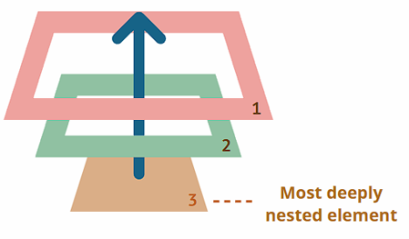

# 웹 브라우저 프로그래밍

## 학습 목표
- 웹 브라우저 환경과 클라이언트 사이드 자바스크립트 이해
- DOM 조작과 노드 제어 방법 습득
- 이벤트 처리와 이벤트 위임 활용
- BOM 객체를 이용한 브라우저 제어
- Web APIs 활용

## 목차
- [1. 웹 브라우저 환경](#1-웹-브라우저-환경)
  + [1.1 웹 브라우저에서 실행되는 자바스크립트 환경](#11-웹-브라우저에서-실행되는-자바스크립트-환경)
- [2. DOM](#2-dom)
  + [2.1 Document 객체](#21-document-객체)
  + [2.2 주요 노드](#22-주요-노드)
  + [2.3 노드 찾기](#23-노드-찾기)
  + [2.4 요소노드의 내부 컨텐츠 제어](#24-요소노드의-내부-컨텐츠-제어)
  + [2.5 노드 제어](#25-노드-제어)
  + [2.6 HTML 속성 다루기](#26-html-속성-다루기)
  + [2.7 style 다루기](#27-style-다루기)
- [3. 이벤트](#3-이벤트)
  + [3.1 이벤트란?](#31-이벤트란)
  + [3.2 이벤트 처리](#32-이벤트-처리)
  + [3.3 Event 객체](#33-event-객체)
  + [3.4 버블링과 캡처링](#34-버블링과-캡처링)
  + [3.5 이벤트 위임](#35-이벤트-위임)

---

## 1. 웹 브라우저 환경
- 참고: https://ko.javascript.info/browser-environment

### 1.1 웹 브라우저에서 실행되는 자바스크립트 환경
- 참고: https://ko.javascript.info/browser-environment

#### ECMAScript
- 참고: https://ecma-international.org/publications-and-standards/standards/ecma-262

- 자바스크립트 언어에 대한 표준
 
#### DOM(Document Object Model)
- 웹페이지 제어를 위한 표준
- https://dom.spec.whatwg.org
- window.document 등
- Event

#### BOM(Browser Object Model)
- 웹페이지 외부의 브라우저 기능 제어를 위한 표준
- HTML 표준: https://html.spec.whatwg.org
- window.navigator: 브라우저와 운영체제에 대한 정보 제공
- window.location: 현재 페이지의 URL에 대한 제어(읽기, 수정)
- window.history: 브라우저의 과거 페이지 이동 정보에 대한 제어(읽기, 수정)
- alert, setTimeout 등

#### Web APIs
- 브라우저가 제공하는 웹 기능을 위한 표준
- https://spec.whatwg.org
- XMLHttpRequest: 서버와 통신에 사용되는 객체(Ajax)
- Web Storage, Notifications API, WebSocket 등

---

## 2. DOM
- 참고: https://ko.javascript.info/dom-nodes

- DOM(Document Object Model) 이란?
  + 브라우저가 HTML 문서를 객체의 트리 구조로 표현한 모델(부모-자식 관계로 연결된 계층 구조)
  + 브라우저는 웹서버에서 다운로드 받은 텍스트 기반의 HTML 문서를 파싱하면서 HTML 문서의 각 구성 요소를 트리구조의 객체로 만들어 자바스크립트로 제공
  + 노드(Node): DOM 트리구조의 모든 구성원은 각각의 객체로 인식되며 이러한 객체 하나하나를 노드라고 함
  + DOM API를 이용하면 정적인 HTML 문서를 자바스크립트로 동적으로 제어하는게 가능(특정 요소를 찾거나 생성, 삽입, 삭제, 이동 등)

- DOM API(DOM Application Programming Interface)
  + DOM을 조작할 수 있는 속성과 메서드들의 집합
  + `querySelector()`: 요소 찾기
  + `createElement()`: 요소 생성
  + `remove()`: 요소 삭제
  + `appendChild()`: 요소 삽입, 이동
  + ...

<table><tr><td width="30%">
Document

  ```html
  <html>
  <head>
  <title>쇼핑목록</title>
  </head>
  <body>
    <h1>쇼핑 목록</h1>
    <p>마트에서 사야할 목록</p>
    <ul id="buy-list" class="list">
      <li>두부</li>
      <li>계란</li>
      <li>라면</li>
    </ul>
  </body>
  </html>
  ```

</td><td>
Object Model


</td><td width="20%">

</td></tr></table>

### 2.1 Document 객체
- 브라우저의 최상위 객체는 window, 웹페이지의 최상위 객체는 window.document
- HTML 문서 전체를 나타냄
- 모든 DOM 조작의 시작점

### 2.2 주요 노드
- DOM에는 12 종류의 노드가 존재하며 주요 노드는 다음과 같음
  + 문서노드(document node): 문서 전체
  + 요소노드(element node): HTML 태그
  + 속성노드(attribute node): 태그의 속성
  + 텍스트노드(text node): 태그 내의 텍스트 내용
  + ...

| 종류 | 설명 | nodeName | nodeType | nodeValue |
|------|------|----------|----------|-----------|
| 문서 노드 | 문서 | #document | 9 | null |
| 요소 노드 | 태그 | 태그의 이름 | 1 | null |
| 속성 노드 | 요소의 속성 | 속성의 이름 | 2 | 속성의 값 |
| 텍스트 노드 | 요소의 내용 | #text | 3 | 문자열 값 |

---

### 2.3 노드 찾기
- 참고: https://ko.javascript.info/searching-elements-dom

#### 2.3.1 태그의 id로 노드 찾기
- `document.getElementById(id)`
- HTML 문서에서 해당 `id`를 가진 요소를 찾아서 반환

```js
const buyList = document.getElementById('buy-list');
```


#### 2.3.2 태그명으로 노드 찾기
- `document.getElementsByTagName(tagName)`
- `요소노드.getElementsByTagName(tagName)`
- 문서 전체 또는 지정한 요소노드의 하위 모든 요소를 대상으로 태그명에 해당하는 요소노드를 NodeList(유사 배열 객체)로 반환

```js
const liList = buyList.getElementsByTagName('li');
```


#### 💻 [05-01 쇼핑 목록 - 요소 찾기 01](../workspace-ins/ch05/ex05-01-01.js)

#### 2.3.3 트리구조로 노드 찾기
- 부모/자식 노드 찾기
- 형제 노드 찾기

##### 부모/자식과 관련된 노드의 속성
- `childNodes`: 자식 노드(요소, 텍스트, 주석 등의 노드)의 목록이 저장된 NodeList(유사 배열) 객체
- `children`: 자식 요소 노드의 목록이 저장된 HTMLCollection(유사 배열) 객체
- `firstChild`: 첫번째 자식 노드(요소, 텍스트, 주석 등의 노드)
- `firstElementChild`: 첫번째 자식 요소 노드
- `lastChild`: 마지막 자식 노드(요소, 텍스트, 주석 등의 노드)
- `lastElementChild`: 마지막 자식 요소 노드
- `parentNode`: 부모 노드
- `parentElement`: 부모 요소 노드

```js
const buyList = document.getElementById('buy-list');
const firstItem = buyList.firstElementChild;
const lastItem = buyList.lastElementChild;
const liList = buyList.childNodes;
```


##### 형제와 관련된 노드의 속성
- `previousSibling`: 바로 앞의 형제 노드(요소, 텍스트, 주석 등의 노드)
- `previousElementSibling`: 바로 앞의 형제 요소 노드
- `nextSibling`: 바로 뒤의 형제 노드(요소, 텍스트, 주석 등의 노드)
- `nextElementSibling`: 바로 뒤의 형제 요소 노드

```js
const buyList = document.getElementById('buy-list');
const secondItem = buyList.childNodes[3];
const firstItem = secondItem.previousElementSibling;
const lastItem = secondItem.nextElementSibling;
```


#### 💻 [05-01 쇼핑 목록 - 요소 찾기 01](../workspace-ins/ch05/ex05-01-01.js)

#### 2.3.4 class 속성으로 노드 찾기
- `document.getElementsByClassName(className)`
- 지정한 클래스명을 가진 요소 노드의 목록을 반환(NodeList, 유사 배열 객체)

```js
const buyList = document.getElementsByClassName('list')[0];
```


#### 💻 [05-01 쇼핑 목록 - 요소 찾기 02](../workspace-ins/ch05/ex05-01-02.js)

#### 2.3.5 CSS 셀렉터 이용
- Selector: CSS에서 사용하는 노드 선택 구문
  + 참고: https://developer.mozilla.org/ko/docs/Web/CSS/CSS_selectors
- `document.querySelector(selector)`: 지정한 selector 구문에 매칭되는 노드 목록 중 첫번째 노드를 반환
- `document.querySelectorAll(selector)`: 지정한 selector 구문에 매칭되는 노드 목록을 반환(NodeList, 유사 배열 객체)

```js
const buyList = document.querySelector('.list');
const buyList = document.querySelector('#buy-list');
const buyList = document.querySelectorAll('ul')[0];
```


#### 💻 [05-01 쇼핑 목록 - 요소 찾기 03](../workspace-ins/ch05/ex05-01-03.js)
#### 💻 [05-02 Counter](../workspace-ins/ch05/ex05-02.html)

---

### 2.4 요소노드의 내부 컨텐츠 제어
- 참고: https://ko.javascript.info/basic-dom-node-properties

#### 2.4.1 innerHTML과 outerHTML
- `elem.innerHTML`: elem의 내부 HTML 코드의 값을 조회하거나 수정 (elem 자신은 제외)
- `elem.outerHTML`: elem의 내부 HTML 코드의 값을 조회하거나 수정 (elem 자신을 포함)

```html
  <ul id="buy-list" class="list">
    <li>두부</li>
    <li>계란</li>
    <li>라면</li>
  </ul>
```

```js
const shoppingList = document.querySelector('#buy-list');
// '\n    <li>두부</li>\n    <li>계란</li>\n    <li>라면</li>\n  '
console.log(shoppingList.innerHTML);
// '<ul id="buy-list" class="list">\n    <li>두부</li>\n    <li>계란</li>\n    <li>라면</li>\n  </ul>'
console.log(shoppingList.outerHTML);
```

#### 2.4.2 textContent와 innerText
- `elem.textContent`: elem의 내부 텍스트 노드의 값을 조회하거나 수정
  + 소스코드의 값 그대로 조회
- `elem.innerText`: elem의 내부 텍스트 노드의 값을 조회하거나 수정
  + 브라우저에 의해서 실제 보이는 값으로 조회, 화면에 보이지 않는 요소는 제외

<table><tr><td>

```html
  <ul id="buy-list" class="list">
    <li>두부<span>✔️</span></li>
    <li>계란<span hidden>✔️</span></li>
    <li>라면<span>✔️</span></li>
  </ul>
```

</td><td width="20%">


</td></tr></table>

```js
const secondLi = document.querySelector('#buy-list > li:nth-child(2)');
console.log(secondLi.textContent); // 계란✔️
console.log(secondLi.innerText);   // 계란
```

---

### 2.5 노드 제어
- 참고: https://ko.javascript.info/modifying-document

#### 2.5.1 노드 생성
- `document.createElement(nodeName)`: 지정한 태그명으로 요소노드 생성
- `document.createTextNode(nodeValue)`: 지정한 내용으로 텍스트노드 생성
- `document.createAttribute(attributeName)`: 지정한 이름으로 속성노드 생성

<table><tr><td>

```js
const newLiNode = document.createElement('li');
const newTextNode = document.createTextNode('우유');
```

</td><td width="20%">


</td></tr></table>

#### 2.5.2 노드 추가
- `요소노드.appendChild(childNode)`: 지정한 노드를 요소노드의 마지막 자식노드로 추가

<table><tr><td>

```js
const newLiNode = document.createElement('li');
const newTextNode = document.createTextNode('우유');
newLiNode.appendChild(newTextNode);
```

</td><td width="20%">

</td></tr></table>

```js
const buyList = document.querySelector('#buy-list');
buyList.appendChild(newLiNode);
```


#### 2.5.3 노드 삽입
- `요소노드.insertBefore(newNode, targetNode)`: 지정한 노드를 targetNode 앞에 삽입

<table><tr><td>

```js
const newLiNode = document.createElement('li');
const newTextNode = document.createTextNode('우유');
newLiNode.appendChild(newTextNode);
```

</td><td width="20%">

</td></tr></table>

```js
const buyList = document.querySelector('#buy-list');
buyList.insertBefore(newLiNode, buyList.firstChild);
```


#### 2.5.4 노드 삭제
- `요소노드.removeChild(childNode)`: 지정한 자식 노드를 삭제
- `요소노드.remove()`: 자신을 삭제

```js
const buyList = document.querySelector('#buy-list');
buyList.removeChild(buyList.firstElementChild);
buyList.firstElementChild.remove();
```


#### 2.5.5 노드 복사
- `노드.cloneNode(withChild)`: 지정한 노드를 복사
  + withChild가 true이면 하위 모든 노드를 같이 복사, false이면 지정한 노드만 복사

<table><tr><td>

```js
const buyList = document.querySelector('#buy-list');
const cloneLi = buyList.firstElementChild.cloneNode(true);
buyList.appendChild(cloneLi);
```

</td><td width="20%">

</td></tr></table>


---

#### 💻 [05-03 쇼핑 목록 - 요소 제어](../workspace-ins/ch05/ex05-03.html)

### 2.6 HTML 속성 다루기
- 참고: https://ko.javascript.info/dom-attributes-and-properties

#### 2.6.1 HTML 표준 속성
- DOM 객체의 속성으로 저장됨

```html
<a href="hello.html">눌러봐</a>

<input type="text" name="userName">
```

```js
const aElem = document.querySelector('a');
console.log(aElem.href); // 'http://127.0.0.1:8080/hello.html'

const imgElem = document.querySelector('img');
console.log(imgElem.src); // 'http://127.0.0.1:8080/hello.png'

imgElem.src = 'bye.png';
console.log(imgElem.src); // 'http://127.0.0.1:8080/bye.png'

const inputElem = document.querySelector('input');
console.log(inputElem.type); // 'text'
console.log(inputElem.name); // 'userName'
```

#### 2.6.2 HTML 표준이 아닌 속성
- `elem.getAttribute(attrName)` 메서드로 읽기
- `elem.setAttribute(attrName, attrValue)` 메서드로 쓰기

```html
<a href="hello.html">눌러봐</a>

<input type="text" name="userName">
```

```js
const imgElem = document.querySelector('img');
console.log(imgElem.format); // undefined
console.log(imgElem.getAttribute('format')); // 'png'
imgElem.setAttribute('format', 'jpg'); // 'jpg'
console.log(imgElem.getAttribute('format')); // 'jpg'
```

#### 2.6.3 custom attribute
- 개발자가 임의로 부여한 HTML 속성
- `data-age`, `data-user-name` 처럼 'data-' 접두어로 시작
- `elem.dataset.age`, `elem.dataset.userName` 처럼 `dataset` 객체의 속성으로 접근 가능
  + 속성명을 `-`로 연결했을 경우 카멜케이스로 변환된 속성명 사용

```html
<a href="hello.html">눌러봐</a>

<input type="text" name="userName">
```

```js
const imgElem = document.querySelector('img');
console.log(imgElem.getAttribute('data-size')); // '10'
console.log(imgElem.dataset.size); // '10'
imgElem.dataset.size = 20;
console.log(imgElem.dataset.size); // '20'
```

#### 💻 [05-06 HTML 속성 접근](../workspace-ins/ch05/ex05-06.html)

### 2.7 style 다루기
- 참고: https://ko.javascript.info/styles-and-classes

#### 2.7.1 요소에 style을 적용하는 방법
- HTML 요소의 style 속성에 직접 스타일 지정
- CSS의 class 작성 후 HTML 요소의 class 속성으로 적용

#### 2.7.2 style 속성 사용
- 동적 스타일이 필요한 경우에만 제한적으로 style 속성 사용

```js
<span style="font-size: 40px;">😆</span>
```

##### style 속성 제어
- `elem.style`: HTML 요소의 `style` 정보가 객체로 저장되어 있는 속성

- 스타일 속성에 접근할 경우 `elem.style.스타일속성명` 형태로 사용
  + `elem.style.top = '10px'`
  + `elem.style.left = '20px'`

- font-size 같이 `-`로 연결한 스타일 속성은 카멜케이스로 변환된 속성명 사용
  + `elem.style.fontSize = '10px'`
  + `elem.style.backgroundColor = 'yellow'`

- 요소노드의 style 속성은 객체이기 때문에 한번에 바꾸기 위해서 문자열을 직접 할당하는 대신 cssText 속성 사용
  + `elem.style = 'font-size: 10px; background-color: yellow;'` (x)
  + `elem.style.cssText = 'font-size: 10px; background-color: yellow;'` (O)

#### 💻 [05-07 style 속성 접근](../workspace-ins/ch05/ex05-07.html)

#### 2.7.3 class 속성 사용(권장)
- 재사용성: 여러 요소에 적용 가능
- 성능 향상: 브라우저의 캐싱
- 유지보수: CSS 파일에서 일괄적인 스타일 관리

```css
.pad100 {
  padding: 100px;
}
.size30 {
  font-size: 30px;
}
```

```html
<ul class="pad100 size30">
  <li>두부</li>
  <li>계란</li>
</ul>
```

##### class 값 전체에 접근
- `elem.className`: class 값이 문자열로 저장되어 있는 속성
  + class는 예약어라서 사용하지 못하므로 className을 대신 사용
- class 값 전체를 바꿀때는 `elem.className = 'pad60 size20'` 처럼 직접 값을 명시

##### class 속성을 하나씩 접근
- `elem.classList`: class 속성의 목록을 가지고 있는 유사 배열 객체
- classList의 속성은 읽기 전용이므로 값을 수정하기 위해서는 classList의 메서드 사용

- `elem.classList.add('hello')`: hello 클래스 추가
- `elem.classList.replace('hello', 'world')`: hello 클래스 수정
- `elem.classList.remove('world')`: hello 클래스 제거
- `elem.classList.toggle('hello')`: hello 클래스가 있으면 제거하고 없으면 추가
- `elem.classList.contains('hello')`: hello 클래스의 존재 여부 반환

```js
elem.classList.add('active');
elem.classList.remove('inactive');
elem.classList.toggle('visible');
```

#### 💻 [05-08 class 속성 접근](../workspace-ins/ch05/ex05-08.html)

#### 2.7.4 class가 적용된 style 확인
- `getComputedStyle(element, [pseudo])`: 최종 계산된 스타일 객체 반환
  + 외부 css 파일, 내부 `<style>`, 인라인 스타일 등 모든 스타일 요소가 반영된 최종 계산된 스타일 반환
  + `elem.style`과 유사한 스타일 정보가 담긴 객체를 반환하지만 모든 속성은 읽기 전용
  + `element`: 스타일 값을 읽을 요소노드
  + `pseudo`: `::before` 같은 pseudo-element의 스타일이 필요할 때

---

## 3. 이벤트
- 참고: https://ko.javascript.info/introduction-browser-events

### 3.1 이벤트란?
- 브라우저에서 어떤 일이 일어났음을 알려주는 신호
- 클릭, 키보드 입력, 마우스 이동, 스크롤 등의 작업
- 주로 요소 노드에서 발생

#### 주요 이벤트 종류
- 마우스 이벤트: click, mousedown, mouseup, mousemove, mouseover, mouseout
- 키보드 이벤트: keydown, keyup
- 폼 이벤트: focus, blur, input, change, submit
- 스크롤 이벤트: scroll
- 문서 로딩 이벤트: load, DOMContentLoaded, beforeunload, unload

### 3.2 이벤트 처리
- 이벤트 핸들러(Event Handler)
  + 특정 이벤트가 발생했을 때 실행되는 함수
- 이벤트 리스너(Event Listener)
  + 이벤트를 감지하고, 발생 시 이벤트 핸들러를 호출하는 매커니즘
  + 이벤트가 발생하는 대상에 이벤트와 이벤트 핸들러를 등록하는 시스템

#### DOM 프로퍼티에 이벤트 핸들러 할당
- DOM Level 0 이벤트 모델
  + 원래는 비표준 이었지만 현재는 호환성을 위해 HTML 표준으로 추가됨
- 요소 노드의 `on<event>` 속성에 이벤트 핸들러를 등록하면 `<event>`가 발생했을 때 등록한 핸들러가 호출됨
- onclick, onmousemove, onkeydown 등

```html
<button>눌러봐</button>
```

```js
const btn = document.querySelector('button');
btn.onclick = function(){
  console.log('버튼 클릭');
}
```

#### HTML 인라인 방식
- DOM Level 0 이벤트 모델
  + 원래는 비표준 이었지만 현재는 호환성을 위해 HTML 표준으로 추가됨
- HTML 태그의 `on<event>` 속성에 `<event>`가 발생했을 때 실행할 코드 지정
- 브라우저는 실행할 코드로 구성된 이벤트 핸들러를 만들어서 요소 노드의 `on<event>` 속성에 등록

```html
<button onclick="console.log('버튼 클릭');">눌러봐</button>
```

- 브라우저에 의해서 다음처럼 동작함
  ```js
  var btn = document.querySelector('button');
  btn.onclick = function(){
    console.log('버튼 클릭');
  }
  ```

#### DOM Level 0 방식의 불편한 점
- `on<event>` 속성의 값은 한개만 존재할 수 있기 때문에 이벤트 핸들러를 여러번 할당하면 기존 값이 덮어 씌워져서 이벤트 핸들러를 여러개 등록할 수 없음

```js
const btn = document.querySelector('button');
btn.onclick = function(){
  console.log('버튼 클릭1');
}
btn.onclick = function(){
  console.log('버튼 클릭2'); // 이전 핸들러가 덮어씌워짐
}
```

#### DOM Level 2 이벤트 모델(DOM 표준)
- DOM Level 0 이벤트 모델 대신 권장되는 이벤트 등록 방식

- `elem.addEventListener(event, handler, [useCapture])`
  + `elem` 요소노드에 `event` 발생시 실행할 `handler` 함수를 등록
  + event: 이벤트 이름 (click, mousemove, keydown 등)
  + handler: 핸들러 함수
  + useCapture: 캡처링 단계의 이벤트 캐치 여부. 기본은 false이고 버블링 단계의 이벤트를 캐치함

```js
const btn = document.querySelector('button');
btn.addEventListener('click', function(){
  console.log('버튼 클릭');
});
btn.addEventListener('click', function(){
  console.log('버튼 클릭'); // 여러 핸들러 등록 가능
});
```

##### `elem.removeEventListener(event, handler, [useCapture])`
- `elem` 요소노드에 `event` 발생시 실행할 `handler` 함수를 제거
- 핸들러를 등록할 때 지정했던 매개변수와 동일한 인자값의 핸들러가 삭제됨

```js
const btn = document.querySelector('button');
btn.addEventListener('click', function(){
  console.log('버튼 클릭');
});
btn.removeEventListener('click', function(){ // 제거 안됨 - 다른 함수 객체
  console.log('버튼 클릭');
});

// 제거하려면 함수를 변수에 저장
const btn = document.querySelector('button');
function handleClick(){
  console.log('버튼 클릭');
}
btn.addEventListener('click', handleClick, true);
btn.removeEventListener('click', handleClick, true); // 제거됨
```

#### 💻 [05-04 이벤트 등록 방법](../workspace-ins/ch05/ex05-04.html)

#### 💻 [05-05 Todo List - DOM API 직접 사용](../workspace-ins/ch05/ex05-05.html)

### 3.3 Event 객체
- 발생한 이벤트의 상세 정보를 담고 있는 객체
- click 이벤트 였다면 마우스의 어떤 버튼이 눌렸는지, keydown 이벤트 였다면 어떤 키가 눌렸는지 처럼 이벤트 상세 정보를 확인하고 싶을때 사용
- 이벤트 핸들러 함수의 첫번째 인자값으로 전달됨

```js
document.addEventListener('mousemove', function(event){
  console.log('마우스 좌표', event.clientX, event.clientY);
});
```

#### 주요 속성과 메서드
- `type`: 발생한 이벤트 명
- `target`: 실제 이벤트가 발생한 요소
- `currentTarget`: 이벤트 핸들러가 등록된 요소
  + `<button>`의 부모 `<div>`에 click 이벤트를 등록하고 button을 누르면 `<div>` 내부가 눌렸으므로 이벤트 핸들러가 호출됨. 이때 target은 `<button>`이 되고 currentTarget은 `<div>`가 됨
- `preventDefault()`: 브라우저의 기본 동작을 취소하는 메서드
  + `<a>` 태그를 누르면 href 주소로 페이지를 이동하는게 브라우저의 기본 동작
  + `<button type="submit">` 버튼을 누르면 서버로 데이터를 전송하는게 브라우저의 기본 동작
- `stopPropagation()`: 이벤트 전파를 중단하는 메서드
- 그밖에 이벤트 종류별로 사용 가능한 속성 제공

<table><tr><td>

```html
<div style="background-color: gray;">
  <button>눌러봐</button>
</div>
```

</td><td width="30%">

</td></tr></table>

```js
var div = document.querySelector('div');
div.addEventListener('click', function(event){
  // button 클릭시 button div div
  // div 클릭시 div div div
  console.log(event.target, event.currentTarget, this);
});
```

#### 💻 [05-09 Event 객체](../workspace-ins/ch05/ex05-09.html)

### 3.4 버블링과 캡처링
- 참고: https://ko.javascript.info/bubbling-and-capturing

#### 버블링(bubbling)
- 특정 요소에 이벤트가 발생하면 해당 요소의 이벤트 핸들러가 먼저 실행된 후 document까지 부모 요소의 이벤트 핸들러가 연달아 실행되는 현상
- addEventListener()의 세번째 매개변수인 useCapture를 생략하면 기본값은 false이고 이는 버블링 단계의 이벤트를 캐치



```html
<html onclick="d()">
  <body onclick="c()">
    <div onclick="b()">
      <button>눌러봐</button>
    </div>
  </body>
</html>
```

```js
document.querySelector('button').addEventListener('click', a, false); // 버블링
```

- `button` 클릭시
  + a() -> b() -> c() -> d() -> document의 onclick 핸들러
  
##### 버블링 중단
- `event.stopPropagation()` 호출시 이벤트 전파 중단
  + 대부분의 경우 버블링을 중단 시킬 일은 없음

#### 캡처링(capturing)
- 이벤트가 document에서 시작해서 타겟 요소까지 하위 요소로 전파되는 단계
- `addEventListener()`의 세번째 매개변수인 useCapture를 true로 지정하면 캡처링 단계의 이벤트를 캐치(버블링 단계의 이벤트는 캐치되지 않음)
  + 대부분의 경우 캡처링을 사용할 일은 없음

```html
<html onclick="d()">
  <body onclick="c()">
    <div onclick="b()">
      <button>눌러봐</button>
    </div>
  </body>
</html>
```

```js
document.querySelector('button').addEventListener('click', a, true); // 캡처링
```

- `button` 클릭시
  + document의 onclick 핸들러 -> d() -> c() -> b() -> a()

#### 이벤트 전파 단계
1. 캡처링(capturing) 단계: 이벤트가 document에서 시작해서 타겟 요소까지 하위 요소로 전파되는 단계
2. 타겟(target) 단계: 이벤트가 타겟 요소에 도달
3. 버블링(bubbling) 단계: 이벤트가 다시 타겟 요소에서 document까지 상위 요소로 전파되는 단계


#### 💻 [05-10 버블링과 캡처링](../workspace-ins/ch05/ex05-10.html)

### 3.5 이벤트 위임
- 참고: https://ko.javascript.info/event-delegation

- 이벤트 발생시 비슷한 처리를 해야하는 요소들이 여럿 있을 경우 각 요소에 하나씩 이벤트 핸들러를 할당하지 않고 공통의 부모 요소에 이벤트 핸들러를 하나만 할당해서 처리하는 방식
- 자식의 이벤트가 부모에게 전파되는 이벤트 버블링을 활용
- event.target 속성으로 실제 이벤트가 발생한 요소 확인 가능
- 동적으로 추가된 자식 요소에 따로 이벤트를 추가할 필요 없음

<table><tr><td>

```html
<style>
td {
  border: 1px solid;
  padding: 10px;
}
td.red {
  background-color: red;
}
</style>

<table>
  <tr>
    <td>1</td><td>2</td><td>3</td>
  </tr>
  <tr>
    <td>4</td><td>5</td><td>6</td>
  </tr>
  <tr>
    <td>7</td><td>8</td><td>9</td>
  </tr>
</table>
```

</td><td width="30%">

</td></tr></table>

```js
const table = document.querySelector('table');
table.addEventListener('click', function(event){
  if(event.target.tagName === 'TD'){
    event.target.classList.toggle('red'); // 클래스 토글
  }
});
```

#### 💻 [05-11 이벤트 위임](../workspace-ins/ch05/ex05-11.html)
