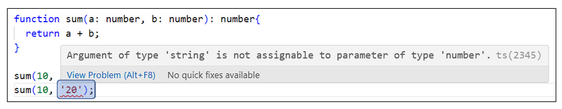

# 타입스크립트

## 학습 목표
- 타입스크립트의 개념 이해
- 타입 정의 및 활용
- 인터페이스와 제네릭 활용
- 타입 안전성 확보

## 목차
- [1. 타입스크립트란?](#1-타입스크립트란)
  + [1.1 타입스크립트란?](#11-타입스크립트란)
  + [1.2 타입스크립트의 동작 방식](#12-타입스크립트의-동작-방식)
  + [1.3 타입스크립트의 장점](#13-타입스크립트의-장점)
  + [1.4 TypeScript Compiler(tsc)](#14-typescript-compilertsc)
- [2. 개발 환경 구축](#2-개발-환경-구축)
  + [2.1 필요한 도구](#21-필요한-도구)
  + [2.2 컴파일 및 실행](#22-컴파일-및-실행)
  + [2.3 타입스크립트 설정 파일](#23-타입스크립트-설정-파일)
  + [2.4 tsc --watch 옵션](#24-tsc---watch-옵션)
- [3. 데이터 타입](#3-데이터-타입)
  + [3.1 기본 타입](#31-기본-타입)
  + [3.2 참조 타입](#32-참조-타입)
  + [3.3 특수 타입](#33-특수-타입)
- [4. Enum](#4-enum)
  + [4.1 Enum이란?](#41-enum이란)
  + [4.2 숫자형 Enum](#42-숫자형-enum)
  + [4.3 문자열 Enum](#43-문자열-enum)
  + [4.4 Enum 활용](#44-enum-활용)
- [5. 함수에 타입 지정](#5-함수에-타입-지정)
  + [5.1 선택적 파라미터 (optional parameter)](#51-선택적-파라미터-optional-parameter)
- [6. 유니언 타입 (union type)](#6-유니언-타입-union-type)
  + [6.1 유니언 타입이란?](#61-유니언-타입이란)
- [7. 타입 별칭 (type alias)](#7-타입-별칭-type-alias)
  + [7.1 타입 별칭이란?](#71-타입-별칭이란)
  + [7.2 타입 별칭으로 객체의 타입 선언](#72-타입-별칭으로-객체의-타입-선언)
- [8. 인터섹션 타입 (intersection type)](#8-인터섹션-타입-intersection-type)
  + [8.1 인터섹션 타입이란?](#81-인터섹션-타입이란)
- [9. 인터페이스](#9-인터페이스)
  + [9.1 인터페이스란?](#91-인터페이스란)
  + [9.2 인터페이스 사용](#92-인터페이스-사용)
  + [9.3 선택적 프로퍼티 (optional property)](#93-선택적-프로퍼티-optional-property)
  + [9.4 읽기 전용 프로퍼티 (readonly)](#94-읽기-전용-프로퍼티-readonly)
  + [9.5 인터페이스 상속](#95-인터페이스-상속)
  + [9.6 계층 구조로 상속](#96-계층-구조로-상속)
  + [9.7 다중 상속](#97-다중-상속)
  + [9.8 선언 병합 (declaration merging)](#98-선언-병합-declaration-merging)
  + [9.9 타입 별칭과 인터페이스의 차이점](#99-타입-별칭과-인터페이스의-차이점)
  + [9.10 인덱스 시그니처 (Index Signature)](#910-인덱스-시그니처-index-signature)
- [10. 제네릭](#10-제네릭)
  + [10.1 제네릭이란?](#101-제네릭이란)
  + [10.2 제네릭 타입 제약](#102-제네릭-타입-제약)
  + [10.3 제네릭 사용처](#103-제네릭-사용처)
- [11. 타입 추론](#11-타입-추론)
  + [11.1 타입 추론이란?](#111-타입-추론이란)
  + [11.2 변수의 타입 추론](#112-변수의-타입-추론)
  + [11.3 객체의 타입 추론](#113-객체의-타입-추론)
  + [11.4 함수의 타입 추론](#114-함수의-타입-추론)
- [12. 리터럴 타입](#12-리터럴-타입)
  + [12.1 리터럴 타입이란?](#121-리터럴-타입이란)
- [13. 타입 단언 (type assertion)](#13-타입-단언-type-assertion)
  + [13.1 타입 단언이란?](#131-타입-단언이란)
  + [13.2 타입 단언 대상](#132-타입-단언-대상)
  + [13.3 타입 단언 주의 사항](#133-타입-단언-주의-사항)
- [14. 타입 가드](#14-타입-가드)
  + [14.1 타입 가드란?](#141-타입-가드란)
  + [14.2 타입 가드 구문](#142-타입-가드-구문)
- [15. 타입 호환](#15-타입-호환)
  + [15.1 타입 호환이란?](#151-타입-호환이란)
  + [15.2 호환 가능 대상](#152-호환-가능-대상)
- [16. 유틸리티 타입 (Utility Types)](#16-유틸리티-타입-utility-types)
  + [16.1 유틸리티 타입이란?](#161-유틸리티-타입이란)
  + [16.2 Readonly&lt;Type&gt;](#162-readonlytype)
  + [16.3 Required&lt;Type&gt;](#163-requiredtype)
  + [16.4 Partial&lt;Type&gt;](#164-partialtype)
  + [16.5 Pick&lt;Type, Keys&gt;](#165-picktype-keys)
  + [16.6 Omit&lt;Type, Keys&gt;](#166-omittype-keys)
  + [16.7 Record&lt;K, T&gt;](#167-recordk-t)
- [17. 맵드 타입 (Mapped Types)](#17-맵드-타입-mapped-types)
  + [17.1 맵드 타입이란?](#171-맵드-타입이란)
  + [17.2 맵드 타입 기본 문법](#172-맵드-타입-기본-문법)
  + [17.3 매핑 수정자](#173-매핑-수정자)
  + [17.4 유틸리티 타입의 구현 원리](#174-유틸리티-타입의-구현-원리)
- [18. 고급 타입 연산자](#18-고급-타입-연산자)
  + [18.1 keyof 연산자](#181-keyof-연산자)
  + [18.2 typeof 연산자](#182-typeof-연산자)
  + [18.3 인덱스 접근 타입 (Indexed Access Types)](#183-인덱스-접근-타입-indexed-access-types)

---

## 1. 타입스크립트란?

### 1.1 타입스크립트란?
- 타입스크립트(TypeScript)는 자바스크립트에 타입을 부여한 언어
- 마이크로소프트에서 개발
- 자바스크립트 기반의 강형(strongly typed) 프로그래밍 언어
- 공식 URL: https://www.typescriptlang.org

### 1.2 타입스크립트의 동작 방식
- 타입스크립트로 작성된 코드는 TypeScript Compiler(tsc)를 이용해 자바스크립트로 컴파일
- 이때 타입 체크가 이루어지고 잘못된 타입을 사용한 경우 컴파일 에러 발생

```ts
// 타입스크립트 코드
function sum(a: number, b: number): number {
  return a + b;
}
sum(10, 20);
```

```js
// 컴파일된 자바스크립트 코드
function sum(a, b) {
  return a + b;
}
sum(10, 20);
```

### 1.3 타입스크립트의 장점
- 에러 사전 검출: 컴파일 타임에 타입 에러 발견
- 코드 가이드 및 자동 완성: IDE에서 타입 기반 자동완성 제공
- 코드 가독성 향상: 타입 정보를 통해 코드 의도 명확화

```js
// 자바스크립트
function sum(a, b) {
  return a + b;
}

sum(10, 20);   // 30
sum(10, '20'); // 1020 (의도하지 않은 결과)
```




### 1.4 TypeScript Compiler(tsc)
- 타입 검사: 타입 검사에서 오류를 찾으면 컴파일 에러가 발생하므로 런타임이 아닌 컴파일 타임에 에러 검출
- 컴파일(트랜스파일)
  + 타입스크립트 소스 코드를 자바스크립트 소스 코드로 변환
  + 타입 관련 구문 제거
  + 브라우저 호환성을 위해 지정한 구(old) 버전의 자바스크립트로 변환

```ts
class Score {
  kor: number;
  eng: number;
  constructor(kor: number, eng: number) {
    this.kor = kor;
    this.eng = eng;
  };
  sum() {
    return this.kor + this.eng;
  };
}
```

```js
// tsc --target es5 명령으로 컴파일
var Score = /** @class */ (function () {
  function Score(kor, eng) {
    this.kor = kor;
    this.eng = eng;
  };
  Score.prototype.sum = function () {
    return this.kor + this.eng;
  }
  return Score;
}());
```

## 2. 개발 환경 구축

### 2.1 필요한 도구
- Node.js: https://nodejs.org/en/download
- VSCode: https://code.visualstudio.com/download
- 최신 버전의 웹 브라우저: Chrome, Safari 등
- TypeScript Compiler
  + node.js용 TypeScript Compiler 모듈을 global로 설치(어느 경로에서나 tsc 명령어 사용 가능)
  + VSCode > View > Terminal
    ```bash
    npm i -g typescript
    ```

### 2.2 컴파일 및 실행

#### 컴파일
- 타입스크립트 코드를 자바스크립트 코드로 변환
```bash
cd workspace/ch06
tsc ex06-01.ts
```

```ts
function hello(name: string): string {
  return 'Hello ' + name;
}
console.log(hello('TypeScript'));
```

```js
function hello(name) {
  return 'Hello ' + name;
}
console.log(hello('TypeScript'));
```

#### 실행
- 컴파일 된 자바스크립트 실행
```bash
node ex06-01.js
```

#### 💻 [06-01 개발 환경 확인](../workspace-ins/ch06/ex06-01.js)

### 2.3 타입스크립트 설정 파일
- tsconfig.json 파일은 타입스크립트의 설정 파일로, 컴파일러(tsc)가 코드를 어떻게 처리할지를 정의

#### 타입스크립트 설정 파일(tsconfig.json) 생성
- 일반적으로 tsconfig.json 파일은 프로젝트 루트에 두지만 본 교육에서는 수강생과 강사의 설정 파일 충돌을 막기 위해서 workspace 하위에 생성
- workspace 에서 실행
```bash
tsc --init
```

#### tsconfig.json 파일 수정
- js로 컴파일시 적용할 버전을 es2022로 지정
  + "compilerOptions"의 "target": "es2022"
- 모듈 시스템을 es2022로 지정(import/export)
  + "compilerOptions"의 "module": "es2022"
- 소스 파일의 루트 폴더를 프로젝트 루트로 지정
  + "compilerOptions"의 "rootDir": "./src" 주석 해제 후 "./"로 수정
- ts 파일과 컴파일된 js 파일을 분리해서 관리
  + 일반적으로 ts와 js 파일 분리를 위해서 설정함
  + 이번 교육에서는 컴파일된 js 파일을 쉽게 확인하기 위해서 ts와 같은 폴더에 컴파일되도록 다음 설정은 하지 않음
  + ~~"compilerOptions"의 "outDir": "./dist" 주석 해제~~
- workspace 하위의 모든 파일을 대상으로 컴파일
  + tsconfig.json 파일이 프로젝트 루트에 있다면 아래의 설정이 필요하지만 tsconfig.json 파일을 workspace 폴더에 두었다면 불필요
  + ~~"compilerOptions" 아래에 "include": ["workspace/**/*"] 추가~~
- 컴파일에서 제외할 폴더나 파일 지정
  + tsconfig.json 파일이 프로젝트 루트에 있다면 아래의 설정이 필요하지만 tsconfig.json 파일을 workspace 폴더에 두었다면 불필요
  + ~~"compilerOptions" 아래에 "exclude": ["node_modules", "sample/**/*"] 추가~~
- 디버깅에 필요한 다음 옵션은 생성되는 파일이 많아져서 복잡해지므로 주석 처리
  + "compilerOptions"의 "sourceMap": true,
  + "compilerOptions"의 "declaration": true,
  + "compilerOptions"의 "declarationMap": true,
- 전체 옵션은 다음 URL 참고
  - <https://www.typescriptlang.org/ko/tsconfig>

### 2.4 tsc --watch 옵션
- 하위 폴더를 포함해서 ts 파일 변경을 감지하고 자동으로 컴파일한 후 outDir로 지정한 폴더에 js 파일 생성
- tsconfig.json 파일이 있는 폴더에서 실행

```bash
tsc --watch
```

## 3. 데이터 타입

### 3.1 기본 타입
- `string`: 문자열
- `number`: 숫자
- `boolean`: 불리언
- `null`: null 값
- `undefined`: undefined 값
- `bigint`: 큰 정수
- `symbol`: 심볼

### 3.2 참조 타입
- `object`: 객체
- `Array<T>`: 배열
- `tuple`: 튜플
- `Date`: 날짜
- `RegExp` 등 내장 생성자 함수

### 3.3 특수 타입
- `any`: 모든 타입 허용(비추천)
- `unknown`: 모든 타입을 허용하지만 사용 전 타입 검사 필수 (any보다 안전)

```ts
let str: string = 'hello';
str = 123; // 컴파일 에러

let age: number = 30;
let done: boolean = true;
let nullVal: null = null;
let emptyVal: undefined;
let todo: object = { title: 'TypeScript 공부', done: false };

// 배열
let todoList: Array<string> = ['JavaScript 공부', 'TypeScript 공부'];
let todoList2: string[] = ['React 공부', 'Next.js 프로젝트'];

// 튜플
let dogs: [string, number] = ['하루', 5];

// any 타입 (비추천)
let userName: any = '이일구';
userName = 219;
```

#### 💻 [06-02 주요 타입](../workspace-ins/ch06/ex06-02.js)

## 4. Enum

### 4.1 Enum이란?
- 타입스크립트에서 지원하는 열거형 데이터 타입
- 유사한 성격의 데이터 집합을 정의
- 관련된 상수들을 하나의 타입으로 묶어서 관리

### 4.2 숫자형 Enum
- 숫자값이 자동으로 할당
- 첫 번째 값은 0부터 시작
- 이후 값은 1씩 증가

```ts
enum Language {
  Javascript, // 0
  C,          // 1
  Python,     // 2
  Java        // 3
}

console.log(Language.Javascript); // 0
console.log(Language.C);         // 1
```

### 4.3 문자열 Enum
- 명시적으로 문자열 값 할당
- 더 명확한 의미 전달

```ts
enum Language {
  Javascript = 'JS',
  C = 'C',
  Python = 'PY',
  Java = 'J'
}

console.log(Language.Javascript); // 'JS'
console.log(Language.C);         // 'C'
```

### 4.4 Enum 활용
- switch문에서 사용하여 코드 가독성 향상
- 타입 안전성 확보

```ts
function getLanguage(lang: Language): string {
  switch(lang) {
    case Language.Javascript:
      return 'JavaScript를 사용합니다.';
    case Language.Python:
      return 'Python을 사용합니다.';
    default:
      return '다른 언어를 사용합니다.';
  }
}
```

#### 💻 [06-02-02 Enum 타입](../workspace-ins/ch06/ex06-02-02.js)

## 5. 함수에 타입 지정
- 매개 변수명 뒤에 지정
- 리턴 타입 지정
  + 매개 변수 선언부 뒤에 지정
  + 리턴 값이 없을 경우에는 `void` 지정

```ts
function getCount(count: number): string {
  return 'Count: ' + count;
}

console.log(getCount(20)); // Count: 20
getCount('30'); // 컴파일 에러(count 인자값이 number가 아님)
const count: number = getCount(40); // 컴파일 에러(count 변수가 string이 아님)
getCount(); // 컴파일 에러(count 인자값이 없음)
getCount(10, 20); // 컴파일 에러(인자값이 하나만 있어야 함)
```

#### 💻 [06-03 함수에 타입 지정](../workspace-ins/ch06/ex06-03.js)

### 5.1 선택적 파라미터 (optional parameter)
- 함수의 매개 변수를 선택적으로 전달받을 때 매개 변수명 뒤에 `?` 추가

```ts
function user(name: string, age?: number): void {
  console.log(name, age);
}

user('하루', 5);     // 하루 5
user('나무');        // 나무 undefined
```

#### 💻 [06-04 선택적 파라미터(optional parameter)](../workspace-ins/ch06/ex06-04.js)

## 6. 유니언 타입 (union type)

### 6.1 유니언 타입이란?
- 여러 종류의 타입을 허용하기 위해 `|` (OR 연산자)로 연결한 타입
- `any` 타입은 모든 타입을 허용하지만 유니언 타입은 `|` 연산자로 연결된 타입 중 하나만 허용

```ts
function log(name: number | string): void {
  console.log(name);
}

log('이일구');
log(219);
```

#### 💻 [06-05 유니언 타입(union type)](../workspace-ins/ch06/ex06-05.js)

## 7. 타입 별칭 (type alias)

### 7.1 타입 별칭이란?
- 값을 변수에 저장하듯, 타입을 변수에 저장해서 사용
- 유니언 타입 같은 복잡한 타입에 의미 있는 이름을 붙여서 사용(별칭)
- `type` 키워드로 선언하는 사용자 정의 타입
- 동일한 이름으로 중복 선언 불가
- JS로 컴파일되면 제거됨
-  관례적인 명명 규칙
  + PascalCase 사용
  + 명사형 사용

- 타입 별칭을 사용하지 않는 경우
  ```ts
  function log(name: number | string): void {
    console.log(name);
  }
  const name1: string | number = '이일구';
  const name2: string | number = 219;

  log(name1);
  log(name2);
  ```

- 타입 별칭을 사용하는 경우
  ```ts
  type UserName = string | number;

  function log(name: UserName): void {
    console.log(name);
  }

  const name1: UserName = '이일구';
  const name2: UserName = 219;

  log(name1);
  log(name2);
  ```

- 컴파일 된 후의 타입 별칭
  ```js
  function log(name) {
    console.log(name);
  }
  const name1 = '이일구';
  const nam2 = 219;

  log(name1);
  log(name2);
  ```

#### 💻 [06-06 유니언 타입](../workspace-ins/ch06/ex06-06.js)

#### 💻 [06-06-02 유니언 타입에 타입 별칭 지정](../workspace-ins/ch06/ex06-06-02.js)

### 7.2 타입 별칭으로 객체의 타입 선언
- 객체의 속성명과 속성값의 타입을 지정
- 속성은 `,` 또는 `;`으로 구분할 수 있지만 공식 스타일 가이드에서는 `;`을 권장
- 타입 별칭을 타입으로 지정한 객체는 타입 별칭에 정의된 속성명과 속성의 타입을 준수해야 함

```ts
type User = {
  name: string,
  age: number;
}

// 객체 생성
const haru: User = { name: '하루', age: 5 };
const haru: User = { name: '하루' }; // 컴파일 에러(age 속성이 없음)
const haru: User = { name: '하루', age: '30' }; // 컴파일 에러(age 속성값이 number가 아님)
const haru: User = { name: '하루', userAge: 30 }; // 컴파일 에러(age 속성이 없음)
```

#### 💻 [06-07 타입 별칭으로 객체의 타입 선언](../workspace-ins/ch06/ex06-07.js)

## 8. 인터섹션 타입 (intersection type)

### 8.1 인터섹션 타입이란?
- 타입 여러 개를 하나로 합치기 위해 `&` (AND 연산자)로 연결한 타입
- 타입 별칭을 확장할 때 주로 사용
- 동일한 속성을 인터섹션 타입으로 추가할 때 타입이 다르면 `never` 타입이 되면서 해당 속성은 사용 불가

```ts
type TodoRegist = {
  id: string;
  title: string;
  content: string;
}

// Todo 타입 확장
type TodoInfo = TodoRegist & {
  id: number; // id: string & number는 존재할 수 없기 때문에 never 타입이 됨
  done: boolean;
};
```

#### 💻 [06-08 인터섹션 타입(intersection type)](../workspace-ins/ch06/ex06-08.js)

## 9. 인터페이스

### 9.1 인터페이스란?
- 객체의 타입을 정의하기 위해 사용(객체의 속성명과 속성값의 타입을 지정)
- 속성은 `,` 또는 `;`으로 구분
- `interface` 키워드로 선언하는 사용자 정의 타입
- 인터페이스를 타입으로 지정한 객체는 해당 인터페이스에 정의된 속성명과 속성의 타입을 준수해야 함
- JS로 컴파일되면 제거됨

```ts
interface User {
  name: string,
  age: number;
}

// 객체 생성
const haru: User = { name: '하루', age: 5 };
const haru: User = { name: '하루' }; // 컴파일 에러(age 속성이 없음)
const haru: User = { name: '하루', age: '30' }; // 컴파일 에러(age 속성값이 number가 아님)
const haru: User = { name: '하루', userAge: 30 }; // 컴파일 에러(age 속성이 없음)
```

#### 💻 [06-09 인터페이스로 객체의 타입 선언](../workspace-ins/ch06/ex06-09.js)

### 9.2 인터페이스 사용

#### 변수, 함수의 매개 변수, 함수의 리턴 타입에 사용
```ts
interface User {
  name: string;
  age: number;
}

// 변수
const haru: User = { name: '하루', age: 5 };

// 함수의 매개 변수
const getAge = (user: User): number => {
  return user.age;
}

// 함수의 리턴 타입
const createUser = (name: string, age: number): User => {
  return { name, age };
}
```

#### 💻 [06-10 인터페이스 사용 - 변수, 함수의 매개변수, 리턴타입](../workspace-ins/ch06/ex06-10.js)

#### 클래스의 타입 지정에 사용
- 클래스명 뒤에 `implements` 키워드 추가
- 인터페이스를 타입으로 지정한 클래스의 멤버 변수와 메서드는 인터페이스에 정의된 속성과 속성의 타입을 준수해야 함

```ts
interface Score {
  kor: number;
  eng: number;
  sum(): number;
  avg(): number;
}

class HighSchool implements Score {
  // ...
}

function printScore(score: Score) {
  console.log(score.sum(), score.avg());
}

const haru = new HighSchool(100, 90);
printScore(haru);
```


#### 💻 [06-11 인터페이스 사용 - 클래스의 타입 지정](../workspace-ins/ch06/ex06-11.js)


### 9.3 선택적 프로퍼티 (optional property)
- 객체의 속성을 선택적으로 부여하고 싶을 때 인터페이스 속성명 뒤에 `?`를 추가

```ts
interface Todo {
  title: string;
  content: string;
  done?: boolean;
}

const todo1: Todo = {
  title: '할일1',
  content: '인터페이스 사용',
  done: true
};

const todo2: Todo = {
  title: '할일2',
  content: 'done 생략'
};
```

### 9.4 읽기 전용 프로퍼티 (readonly)
- 인터페이스의 속성명 앞에 `readonly` 키워드 추가
- 객체 생성 시에만 값 할당이 가능하고 생성된 이후에는 수정할 수 없는 속성을 만들 때 사용

```ts
interface Todo {
  readonly id: number;
  title: string;
  content: string;
  done?: boolean;
}

const todo1: Todo = { id: 1, title: '할일1', content: '인터페이스 사용', done: true };
todo1.content = '수정함';
todo1.id = 2; // 컴파일 에러(id는 readonly이므로 수정 불가)

const todo2: Todo = { id: 2, title: '할일2', content: 'done 생략' };
```

#### 💻 [06-12 인터페이스 정의 - 선택적 속성, 읽기 전용 속성](../workspace-ins/ch06/ex06-12.js)

### 9.5 인터페이스 상속
- 부모 인터페이스의 속성과 메서드 정의를 자식 인터페이스가 물려받고 확장
- `interface` 선언부의 `extends` 키워드 뒤에 상속받을 부모 인터페이스 지정

```ts
interface Todo {
  title: string;
  content: string;
}

interface TodoInfo extends Todo {
  id: number,
  done: boolean
}
```

#### 💻 [06-13 인터페이스 상속](../workspace-ins/ch06/ex06-13.js)

### 9.6 계층 구조로 상속
- 인터페이스 상속은 여러 단계의 계층 구조로 구성 가능

```ts
interface Todo {
  title: string;
  content: string;
}

interface TodoInfo extends Todo {
  id: number;
  done: boolean;
}

interface TodoInfoWithTime extends TodoInfo {
  createdAt: Date;
  updatedAt: Date;
}
```

#### 💻 [06-14 인터페이스 상속 - 계층 구조](../workspace-ins/ch06/ex06-14.js)

### 9.7 다중 상속
- 둘 이상의 인터페이스를 상속받음
- 여러 인터페이스에 동일한 속성이 중복으로 존재해도 가능하지만 동일한 타입(타입 호환)이어야 함

```ts
interface Todo {
  title: string;
  content: string;
}

interface TodoList {
  id: number;
  title: string;
  done: boolean;
}

interface TodoInfo extends Todo, TodoList {
  // ...
}
```

#### 💻 [06-15 인터페이스 상속 - 다중 상속](../workspace-ins/ch06/ex06-15.js)

### 9.8 선언 병합 (declaration merging)
- 동일한 이름의 인터페이스를 중복으로 선언
- 기존 인터페이스에 없는 속성을 추가해서 확장
- 기존 속성과 중복으로 정의는 가능하지만 동일한 타입(타입 호환)이어야 함

```ts
// Todo 인터페이스 정의
interface Todo {
  id: number;
  title: string;
  content: string;
}

// Todo 인터페이스 선언 병합
interface Todo {
  id: string; // 컴파일 에러
  title: string; // 가능
  done: boolean;
};
```

```ts
// Todo 타입 별칭 정의
type Todo = {
  id: number;
  title: string;
  content: string;
}

// 인터섹션 타입을 이용한 Todo 타입 별칭 확장
type TodoInfo = Todo & {
  id: string; // never 타입이 되면서 사용 불가
  done: boolean;
};
```

#### 💻 [06-16 인터페이스 선언 병합](../workspace-ins/ch06/ex06-16.js)

### 9.9 타입 별칭과 인터페이스의 차이점

#### 정의할 수 있는 타입 종류
- 타입 별칭: 객체, 클래스, 기본 타입, 유니언 타입, 인터섹션 타입, 유틸리티 타입, 맵드 타입 등의 정의에 사용
- 인터페이스: 객체, 클래스의 타입 정의

#### 타입 확장
- 타입 별칭: `&` 연산자로 확장(인터섹션 타입)
- 인터페이스: `extends` 키워드로 확장, 동일한 이름의 인터페이스 재정의(선언 병합)

#### 타입 별칭이 필요한 경우
- 객체의 타입을 지정하는 경우 확장이 용이한 인터페이스 사용을 권장
- 객체가 아닌 타입 별칭으로만 정의할 수 있는 경우에만 타입 별칭 사용을 권장

### 9.10 인덱스 시그니처 (Index Signature)
- 속성명을 명시하지 않고 속성명의 타입과 속성값의 타입을 정의
- 동일한 타입을 가진 여러 속성들을 하나로 정의 가능
- 동적 속성을 가진 객체에 유용

```ts
interface User {
  name: string;
  email: string;
  [key: string]: string; // 인덱스 시그니처
}

const user1: User = {
  name: '하루',
  email: 'haru@example.com',
  phone: '010-1234-5678',
  address: '서울시'
};
```

#### 주의사항
- 속성명 타입: `string`, `number`, `symbol`만 가능
- 일반 속성과 함께 사용시 일반 속성값의 타입은 인덱스 시그니처 타입과 같아야 함
- 인덱스 시그니처에 정의한 속성명은 아무 문자나 사용 가능

```ts
interface User {
  name: string;
  email: string;
  [etc: string]: string; // etc 대신 다른 이름 사용 가능
}

interface User {
  name: string;
  age?: number; // 에러: 인덱스 시그니처 타입(string)과 일치하지 않음
  [etc: string]: string;
}
```

## 10. 제네릭

### 10.1 제네릭이란?
- 함수를 생성할 때 함수에서 사용할 매개 변수, 리턴 타입을 정의하지 않고 호출하는 시점에 원하는 타입을 지정해서 사용
- 함수 내부의 코드는 동일하고 매개 변수나 리턴 타입만 다를 경우 제네릭 문법을 이용하면 하나의 함수로 구현 가능
- 제네릭에 지정한 문자 `T`는 아무 문자나 사용 가능하고 여러 글자도 사용 가능
  + `Type`의 앞글자인 `T`를 주로 사용

```ts
// 제네릭 없이
function echoString(msg: string): string {
  return msg;
}

function echoNumber(msg: number): number {
  return msg;
}

function echoBoolean(msg: boolean): boolean {
  return msg;
}

console.log(echoString('hello'));
console.log(echoNumber(100));
console.log(echoBoolean(true));

// 제네릭으로
function echo<T>(msg: T): T {
  return msg;
}

console.log(echo<string>('hello'));
console.log(echo<number>(100));
console.log(echo<boolean>(true));
console.log(echo<string>(300)); // 에러
```

#### 💻 [06-17 echo 함수 - 일반 함수](../workspace-ins/ch06/ex06-17.js)

#### 💻 [06-17-02 echo 함수 - 제네릭 함수](../workspace-ins/ch06/ex06-17-02.js)

### 10.2 제네릭 타입 제약
- 제네릭에 전달받을 타입을 지정한 타입만 가능하도록 제약하는 방법으로 `extends` 키워드 사용
  + `<T extends string | number>`
  + `<T extends { length: number }>`

```ts
function echo<T extends string | number>(msg: T): T {
  return msg;
}

function echo2<T extends { length: number }>(msg: T): T {
  console.log('msg.length: ', msg.length);
  return msg;
}

console.log(echo<string>('haru'));
console.log(echo<number>(100));
console.log(echo2<string>('namu'));
console.log(echo2<string[]>(['haru', 'namu']));
```

#### 💻 [06-17-03 echo 함수 - 제네릭 타입 제약](../workspace-ins/ch06/ex06-17-03.js)

### 10.3 제네릭 사용처
- 함수, 인터페이스, 클래스 정의에 사용

```ts
// 함수
function echo<T>(msg: T): T {
  return msg;
}

// 인터페이스
interface DropdownItem<T> {
  value: T;
  selected?: boolean;
}

// 클래스
class List<T> {
  private items: T[] = [];
  add(item: T) {
    this.items.push(item);
  }
  getAll(): T[] {
    return this.items;
  }
}

const nameList = new List<string>();
nameList.add('haru');
nameList.add('namu');
console.log(nameList.getAll());

const ageList = new List<number>();
ageList.add(5);
ageList.add(8);
console.log(ageList.getAll());
```

#### 💻 [06-18 제네릭 사용처](../workspace-ins/ch06/ex06-18.js)

#### 💻 [06-18-02 드롭다운 리스트 생성 - 자바스크립트](../workspace-ins/ch06/ex06-18-02.js)

#### 💻 [06-18-03 드롭다운 리스트 생성 - 타입스크립트](../workspace-ins/ch06/ex06-18-03.js)

#### 💻 [06-18-04 드롭다운 리스트 생성 - 유니온 타입](../workspace-ins/ch06/ex06-18-04.js)

#### 💻 [06-18-05 드롭다운 리스트 생성 - 제네릭 인터페이스와 함수](../workspace-ins/ch06/ex06-18-05.js)

## 11. 타입 추론

### 11.1 타입 추론이란?
- 명시적으로 타입을 지정하지 않아도 타입스크립트가 코드를 해석해서 적절한 타입을 자동으로 정의

### 11.2 변수의 타입 추론
- 할당된 값과 일치하는 타입
- 선언만 된 상태라면 `any` 타입
  - `any` 타입으로 추론된 이후에 값을 할당해도 타입은 변경되지 않고 여전히 `any` 타입이 유지됨
  - 선언 시점을 기반으로 추론

```ts
let name = '이일구'; // string으로 타입 추론
name = 219; // 타입 에러

const age = 20; // number로 타입 추론

let name2; // any로 타입 추론
name2 = '이일구'; // string 타입이 되는게 아니고 여전히 any 타입
name2 = 219;
```

#### 💻 [06-19 변수의 타입 추론](../workspace-ins/ch06/ex06-19.js)

### 11.3 객체의 타입 추론
- 객체를 선언과 동시에 초기화할 때 타입을 명시하지 않으면 객체 내부의 속성과 속성값에 맞춰서 타입을 자동으로 정의
  - 문자열 값을 가진 속성이라면 `string` 타입
  - 숫자 값을 가진 속성이라면 `number` 타입

```ts
const todo1 = {
  id: 12,
  title: '타입 추론',
  content: '타입스크립트가 코드를 분석해서 적절한 타입을 자동으로 지정',
};
// todo1.id = '13'; // 타입 에러

// 추론되는 타입
const todo1: {
  id: number;
  title: string;
  content: string;
}
```

#### 💻 [06-20 객체의 타입 추론](../workspace-ins/ch06/ex06-20.js)

### 11.4 함수의 타입 추론
#### 매개 변수의 타입
- 매개 변수의 타입을 지정하지 않으면 `any` 타입으로 추론
- 기본값 매개 변수를 지정했을 경우 할당된 값과 일치하는 타입으로 추론하고 `?`(선택적 파라미터) 추가

#### 리턴 타입
- 리턴값을 기반으로 추론
- 매개 변수가 리턴값에 영향을 미치면 매개 변수의 타입과 연산자를 기반으로 리턴값의 타입을 추론
- 예: `num + 20`은 `number + number`이므로 결과도 `number`로 추론

```ts
function add(num=10) {
  return num + 20; // number로 추론
}

// 추론되는 타입
function add(num?: number): number
```

#### 💻 [06-21 함수의 타입 추론](../workspace-ins/ch06/ex06-21.js)
#### 💻 [06-21-02 함수의 타입 추론 - 리턴 타입 생략시](../workspace-ins/ch06/ex06-21-02.js)

## 12. 리터럴 타입

### 12.1 리터럴 타입이란?
- 특정 "값" 자체를 타입으로 사용
- `string`처럼 문자열 전체가 지정 가능한 타입이 아니라 `하루`, `나무` 같은 특정 값만 가지도록 제한하는 타입
- 잘못된 값의 입력을 미리 막아서 타입 안전성을 높임

```ts
function walkWithMyDog(name: '하루' | '나무', time: 1 | 2) {
  console.log(`${time}시간 동안 ${name}와 산책합니다.`);
}

walkWithMyDog('하루', 1);
walkWithMyDog('나무', 2);
walkWithMyDog('가을', 3); // 타입 에러
```

#### 💻 [06-19-02 리터럴 타입](../workspace-ins/ch06/ex06-19-02.js)

## 13. 타입 단언 (type assertion)

### 13.1 타입 단언이란?
- 타입스크립트의 타입 추론에 기대지 않고 명시적으로 직접 타입을 지정
- `as` 키워드로 타입을 지정하면 타입스크립트 컴파일러가 타입 검사를 수행하지 않음
- 넓은 범위의 타입을 더 구체적인 타입으로 지정할 때 사용

### 13.2 타입 단언 대상
- 리터럴: 원시형 데이터 타입의 값, 객체, 함수의 리턴값

```ts
function getMsg(msg: string | number) {
  return msg;
}

const namu = getMsg('namu') as string;
// 타입 단언이 없으면 toUpperCase() 메서드 사용 시 컴파일 에러 발생
console.log(namu.toUpperCase()); // NAMU

const avg = getMsg(123.456) as number;
// 타입 단언이 없으면 toFixed() 메서드 사용 시 컴파일 에러 발생
console.log(avg.toFixed(2)); // 123.46
```

#### 💻 [06-22 타입 단언](../workspace-ins/ch06/ex06-22.js)

#### 💻 [06-23 타입 단언이 필요한 JS 코드](../workspace-ins/ch06/ex06-23.js)

#### 💻 [06-23-02 타입 단언 - JS로 작성된 코드를 TS로 리팩토링](../workspace-ins/ch06/ex06-23-02.js)

### 13.3 타입 단언 주의 사항
- `as` 키워드는 변수에는 지정할 수 없고 데이터(값)에만 지정 가능
- 호환되는 타입으로만 타입 단언이 가능
  + `const a = 10 as string;` // error
- `any`, `unknown`은 모든 타입과 호환 가능
- `any`로 타입 단언을 하면 TSC가 타입 검사를 하지 않기 때문에 런타임 오류 발생 가능성이 높아지므로 남용 금지(타입 안전성이 높은 `unknown` 권장)
- 가능하다면 타입은 선언해서 사용하고 꼭 필요한 경우에만 타입 단언 사용을 권장

## 14. 타입 가드

### 14.1 타입 가드란?
- 함수의 매개 변수로 여러 종류의 타입이 지정되었을 경우(유니언 타입) 정확한 타입 추론을 할 수 있도록 TSC에 힌트를 주는 구문
- 주로 조건문을 이용하고 TSC가 조건문의 구문을 인식해서 조건문 내부에서 만큼은 적절한 타입으로 추론할 수 있도록 도와주는 문법

### 14.2 타입 가드 구문
- `null`, `undefined` 체크
- 논리 연산자(`&&`)
- `typeof` 연산자
- `in` 연산자(객체에 지정한 속성이 포함되었는지 여부를 반환)
- `instanceof` 연산자
- 구별된 유니언 타입 (discriminated unions)
  + 타입 별칭이나 인터페이스의 속성 정의 시 구체적인 값을 지정한 후 객체의 속성값으로 확인
  + 예: `admin: boolean` 대신 `admin: true`
- 타입 가드 함수 작성
  + `is` 연산자를 사용해서 타입 가드 기능을 하도록 만든 함수
  + 반환 타입이 `type is Type` 형식이면 타입 가드 함수로 인식
    ```ts
    function isAdmin(user: Admin | User): user is Admin {
      return 'role' in user;
    }
    ```

```ts
function log(msg: number | string) {
  if (typeof msg === 'string') {
    // 이 블록에서는 msg가 string 타입으로 추론
    console.log(msg.toUpperCase());
  } else {
    // 이 블록에서는 msg가 number 타입으로 추론
    console.log(msg.toFixed(2));
  }
}
```

```ts
interface Admin {
  id: string;
  role: string;
}

interface User {
  id: string;
  email: string;
}

function isAdmin(user: Admin | User): user is Admin {
  return 'role' in user;
}

function checkUser(user: Admin | User) {
  if (isAdmin(user)) {
    // 이 블록에서는 user가 Admin 타입으로 추론
    console.log(user.role);
  } else {
    // 이 블록에서는 user가 User 타입으로 추론
    console.log(user.email);
  }
}
```

```ts
class Car {
  drive() {
    console.log('Driving...');
  }
}

class Bike {
  ride() {
    console.log('Riding...');
  }
}

function useVehicle(vehicle: Car | Bike) {
  if (vehicle instanceof Car) {
    // 이 블록에서는 vehicle이 Car 타입으로 추론
    vehicle.drive();
  } else {
    // 이 블록에서는 vehicle이 Bike 타입으로 추론
    vehicle.ride();
  }
}
```

```ts
function getLength(value: string | string[] | null) {
  if (value === null) {
    return 0;
  }
  
  if (typeof value === 'string') {
    return value.length;
  }
  
  return value.length; // string[]로 추론
}
```

```ts
interface Admin {
  role: 'admin';
  permissions: string[];
}

interface User {
  role: 'user';
  email: string;
}

function checkRole(member: Admin | User) {
  if (member.role === 'admin') {
    // 이 블럭에서는 member가 Admin 타입으로 추론
    console.log(member.permissions);
  } else {
    // 이 블럭에서는 member가 User 타입으로 추론
    console.log(member.email);
  }
}
```

#### 💻 [06-05-02 유니언 타입과 타입 가드](../workspace-ins/ch06/ex06-05-02.js)

#### 💻 [06-24 타입 가드 - 함수가 null을 리턴할 수 있을 경우](../workspace-ins/ch06/ex06-24.js)

#### 💻 [06-25 타입 가드 - typeof 연산자, instanceof 연산자](../workspace-ins/ch06/ex06-25.js)

#### 💻 [06-26 타입 가드 - 속성 값으로 타입 체크](../workspace-ins/ch06/ex06-26.js)

#### 💻 [06-27 타입 가드 함수 작성](../workspace-ins/ch06/ex06-27.js)

## 15. 타입 호환

### 15.1 타입 호환이란?
- 두 타입이 서로 대입 가능한지 여부를 판단하는 규칙
- 타입 호환 여부는 구조적 타입 시스템(Structural Type System)에 기반
  - 타입을 비교할 때 타입의 구조를 기준으로 호환 여부를 판단
  - 두 타입이 호환되려면 한 타입이 다른 타입의 모든 프로퍼티와 메서드를 포함해야 함

### 15.2 호환 가능 대상
- 인터페이스, 클래스: 프로퍼티 비교(프로퍼티명과 타입)
- 함수: 인자의 수와 타입, 리턴 타입을 기준으로 판단(call signature)

```ts
interface Member {
  id: number;
  name: string;
  age: number;
}

interface Guest {
  name: string;
}

const namu: Member = {
  id: 1,
  name: '나무',
  age: 8
};

function welcome(member: Guest) {
  console.log(`안녕하세요. ${member.name}님`);
}

welcome(namu); // namu는 name 프로퍼티를 가지고 있으므로 호환 가능
```

#### 💻 [06-28 타입 호환](../workspace-ins/ch06/ex06-28.js)

## 16. 유틸리티 타입 (Utility Types)

### 16.1 유틸리티 타입이란?
- 정의되어 있는 타입을 기반으로 새로운 타입을 반환하는 타입스크립트 내장 타입
- 대상 타입은 변경되지 않고 새로운 타입을 생성함
- 참고: https://www.typescriptlang.org/ko/docs/handbook/utility-types.html

### 16.2 Readonly<Type>
- Type의 모든 속성을 readonly로 설정한 타입 생성

```ts
interface Todo {
  title: string;
  content: string;
}

const todo: Readonly<Todo> = {
  title: '할일 1',
  content: '내용 1'
};

todo.title = '수정'; // 컴파일 에러
```

#### 💻 [06-29 Readonly](../workspace-ins/ch06/ex06-29.js)

### 16.3 Required<Type>
- Type의 모든 속성을 필수로 설정한 타입 생성
- 옵셔널 프로퍼티를 필수로 변경

```ts
interface Todo {
  title: string;
  content?: string;
}

const todo1: Todo = {
  title: '할일 1'
  // content 생략 가능
};

const todo2: Required<Todo> = {
  title: '할일 1'
  // 컴파일 에러: content 속성이 필수
};
```

#### 💻 [06-30 Required](../workspace-ins/ch06/ex06-30.js)

### 16.4 Partial<Type>
- Type의 모든 속성을 옵셔널로 설정한 타입 생성
- 일부 속성만 있는 객체를 생성할 때 유용

```ts
interface Todo {
  title: string;
  content: string;
}

const todo1: Todo = {
  title: '할일 1'
  // 컴파일 에러: content 속성이 없음
};

const todo2: Partial<Todo> = {
  title: '할일 1'
  // content 생략 가능
};
```

#### 💻 [06-31 Partial](../workspace-ins/ch06/ex06-31.js)

### 16.5 Pick<Type, Keys>
- Type에서 Keys 속성을 선택해 타입 생성
- Keys는 단일 키나 유니온으로 여러 키 조합 가능
- 원래 속성의 특징을 그대로 받음(readonly, optional 등)

```ts
interface Todo {
  id: number;
  title: string;
  content: string;
  done: boolean;
  createdAt: Date;
  updatedAt: Date;
}

type TodoRegist = Pick<Todo, 'title' | 'content'>;

const todo: TodoRegist = {
  title: '할일 1',
  content: '등록에 사용'
};
```

#### 💻 [06-32 Pick](../workspace-ins/ch06/ex06-32.js)

### 16.6 Omit<Type, Keys>
- Type의 모든 속성에서 Keys를 제거한 타입 생성

```ts
interface Todo {
  id: number;
  title: string;
  content: string;
  done: boolean;
  createdAt: Date;
  updatedAt: Date;
}

type TodoInfo = Omit<Todo, 'createdAt' | 'updatedAt'>;

const todo: TodoInfo = {
  id: 2,
  title: '할일 2',
  content: '상세조회에 사용',
  done: true
};
```

#### 💻 [06-33 Omit](../workspace-ins/ch06/ex06-33.js)

### 16.7 Record<K, T>
- 키-값 쌍의 타입 정의
- K는 키의 타입, T는 값의 타입

```ts
type UserRole = 'admin' | 'user' | 'guest';
type UserPermissions = Record<UserRole, string[]>;

const permissions: UserPermissions = {
  admin: ['read', 'write', 'delete'],
  user: ['read', 'write'],
  guest: ['read']
};
```

#### 💻 [06-34 Record](../workspace-ins/ch06/ex06-34.js)

## 17. 맵드 타입 (Mapped Types)

### 17.1 맵드 타입이란?
- 이미 정의된 타입을 기반으로 새로운 타입을 생성하는 타입 문법
- 문자열, 숫자, 심볼로 구성된 유니언 타입을 기반으로 객체 타입 생성
- 객체 타입에서 일부만 변경한 새로운 객체 타입 생성

### 17.2 맵드 타입 기본 문법
- `[Prop in Type]: Value` 문법 사용
- Type의 각 속성에 대해 새로운 타입을 생성

```ts
type UserFields = 'id' | 'name' | 'address' | 'phone';
type User = {
  [Prop in UserFields]: string;
};

const haru: User = {
  id: '1',
  name: '하루',
  address: '김포시',
  phone: '010-2222-3333'
};
```

#### 💻 [06-35 맵드 타입 기본 문법](../workspace-ins/ch06/ex06-35.js)

### 17.3 매핑 수정자
- 속성의 특성을 변경하는 키워드
- `?`, `-?`, `readonly`, `-readonly` 수정자 사용

```ts
interface Todo {
  id: string;
  title: string;
}

// 모든 속성을 옵셔널로 만들기
type OptionalTodo = {
  [Property in keyof Todo]?: Todo[Property];
};

// 직접 MyPartial 구현하기
type MyPartial<T> = {
  [Property in keyof T]?: T[Property];
};

type OptionalTodo2 = MyPartial<Todo>;
// 유틸리티 타입과 동일
type OptionalTodo3 = Partial<Todo>;
```

#### 💻 [06-36 맵드 타입 매핑 수정자](../workspace-ins/ch06/ex06-36.js)

### 17.4 유틸리티 타입의 구현 원리
- 유틸리티 타입은 맵드 타입으로 구현됨
- `keyof` 연산자로 객체의 키 타입을 추출
- 인덱스 접근 타입 `T[Property]`로 속성값 타입을 추출

```ts
// Partial의 내부 구현과 동일
type MyPartial<T> = {
  [P in keyof T]?: T[P];
};

// Readonly의 내부 구현과 동일
type MyReadonly<T> = {
  readonly [P in keyof T]: T[P];
};

// Pick의 내부 구현과 동일
type MyPick<T, K extends keyof T> = {
  [P in K]: T[P];
};
```

#### 💻 [06-37 유틸리티 타입 구현 원리](../workspace-ins/ch06/ex06-37.js)

## 18. 고급 타입 연산자

### 18.1 keyof 연산자
- 객체 타입의 키를 유니언 타입으로 추출
- 객체의 모든 키 이름을 타입으로 사용

```ts
interface Todo {
  id: number;
  title: string;
  content: string;
}

type TodoKeys = keyof Todo; // 'id' | 'title' | 'content'

function getProperty(obj: Todo, key: keyof Todo) {
  return obj[key];
}

const todo: Todo = { id: 1, title: '제목', content: '내용' };
const id = getProperty(todo, 'id'); // 1
```

#### 💻 [06-38 keyof 연산자](../workspace-ins/ch06/ex06-38.js)

### 18.2 typeof 연산자
- 런타임 값의 타입을 추출
- 값으로부터 타입을 생성

```ts
const haru = {
  name: '하루',
  age: 25,
  city: '김포시'
};

type HaruType = typeof haru;
// { name: string; age: number; city: string; }

const muzi: HaruType = {
  name: '무지',
  age: 30,
  city: '서울시'
};
```

#### 💻 [06-39 typeof 연산자](../workspace-ins/ch06/ex06-39.js)

### 18.3 인덱스 접근 타입 (Indexed Access Types)
- 타입의 특정 속성 타입을 추출
- 배열 타입의 요소 타입 추출

```ts
interface Todo {
  id: number;
  title: string;
  content: string;
}

type TodoTitle = Todo['title']; // string
type TodoIdOrContent = Todo['id' | 'content']; // number | string

type TodoArray = {
  0: Todo;
  1: Todo;
  length: 2;
};

type FirstTodo = TodoArray[0]; // Todo
```

#### 💻 [06-40 인덱스 접근 타입](../workspace-ins/ch06/ex06-40.js)

---
